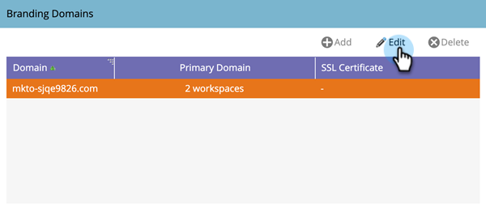

# Editar el dominio de marca predeterminado {#edit-your-default-branding-domain}

La edición del dominio de marca predeterminado es el primer paso para trabajar con dominios de marca.

>[!PREREQUISITES]
>
>Asegúrese de que [configurar un CNAME en el DNS](/help/marketo/getting-started/setup/configure-protocols-for-marketo.md) antes de añadir los dominios de marca en Marketo.

1. Vaya a la **Administrador** .

   

1. Haga clic en **Correo electrónico**.

   

1. En la tabla Dominios de marca, seleccione el dominio genérico y haga clic en Editar para cambiarlo al dominio de marca de la empresa.

   

   >[!NOTE]
   >
   >No puede agregar un dominio adicional hasta que haya editado por primera vez el dominio genérico.

1. Introduzca el nombre del dominio predeterminado y haga clic en Guardar.

   

Ahora, puede [agregar dominios de marca adicionales](/help/marketo/product-docs/administration/email-setup/add-multiple-branding-domains/add-an-additional-branding-domain.md) necesitas.
