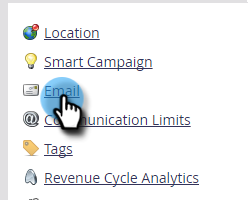

# Editar el dominio de marca predeterminado {#edit-your-default-branding-domain}

Editar el dominio de marca predeterminado es el primer paso para trabajar con dominios de marca.

>[!PREREQUISITES]
>
>Asegúrese de [configurar un CNAME en su DNS](/help/marketo/getting-started/initial-setup/configure-protocols-for-marketo.md){target="_blank"} antes de agregar los dominios de promoción de la marca en Marketo.

1. Vaya al área de **[!UICONTROL Admin]**.

   

1. Haga clic en **[!UICONTROL Correo electrónico]**.

   

1. En la tabla [!UICONTROL Dominios de marca], seleccione el dominio genérico y haga clic en **[!UICONTROL Editar]** para cambiarlo al dominio de marca de su compañía.

   

   >[!NOTE]
   >
   >No puede agregar un dominio adicional hasta que haya editado primero el dominio genérico.

1. Escriba el nombre de su dominio predeterminado y haga clic en **[!UICONTROL Guardar]**.

   

Ahora puede [agregar los dominios de promoción de la marca adicionales](/help/marketo/product-docs/administration/email-setup/add-multiple-branding-domains/add-an-additional-branding-domain.md){target="_blank"} que necesite.

>[!NOTE]
>
>Si necesita actualizar o quitar un SSL existente, comuníquese con [Soporte técnico de Marketo](https://nation.marketo.com/t5/support/ct-p/Support){target="_blank"}.
