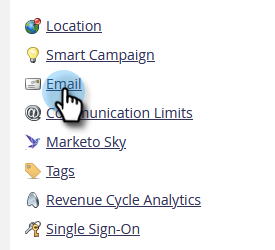

# Cambiar límites personalizados de recuperación de objetos en [!DNL Velocity Scripting] {#change-custom-object-retrieval-limits-in-velocity-scripting}

Si usa [!DNL Velocity Script] para mostrar datos de objetos personalizados en correos electrónicos, esta característica podría aplicarse a su caso de uso. De forma predeterminada, se le permite acceder a 10 objetos personalizados principales desde Secuencia de comandos de Velocity. Si necesita acceder a más, consulte los pasos a continuación.

## Qué es [!DNL Velocity] {#what-is-velocity}

[[!DNL Apache Velocity]](https://velocity.apache.org/) es un lenguaje creado en [!DNL Java] y diseñado para crear plantillas y scripts de contenido de HTML. Marketo permite utilizarlo en el contexto de los mensajes de correo electrónico mediante el uso de [tokens de script](/help/marketo/product-docs/email-marketing/general/using-tokens/create-an-email-script-token.md). Entre otras cosas, esto da acceso a los datos almacenados en objetos personalizados.

Puede hacer referencia a objetos personalizados primarios y secundarios que estén conectados directamente al posible cliente o contacto, pero no a objetos personalizados de tercer nivel. Para cada objeto personalizado, los 10 registros actualizados más recientemente por persona/contacto están disponibles en tiempo de ejecución y se ordenan desde los actualizados más recientemente (en 0) a los actualizados más antiguos (en 9).

## Cómo cambiar el límite {#how-to-change-the-limit}

1. Vaya a la sección **[!UICONTROL Admin]**.

   

1. Haga clic en **[!UICONTROL Correo electrónico]**.

   

1. En la tabla [!UICONTROL Límites personalizados de recuperación de objetos], escriba un nuevo [!UICONTROL Límite de recuperación principal] y haga clic en **[!UICONTROL Guardar cambios]**.

   

>[!NOTE]
>
>El valor de [!UICONTROL Límite de recuperación principal] debe estar entre 10 y 100. El [!UICONTROL límite de recuperación de elementos secundarios] se ha establecido automáticamente. Esto se hace dividiendo 1000 entre [!UICONTROL Límite de recuperación principal]. Por ejemplo, si establece el límite Principal en 50, el límite Secundario se convierte en 20 (1000 ÷ 50 = 20).

Ahora puede tener acceso a más objetos personalizados desde [!DNL Velocity script].
