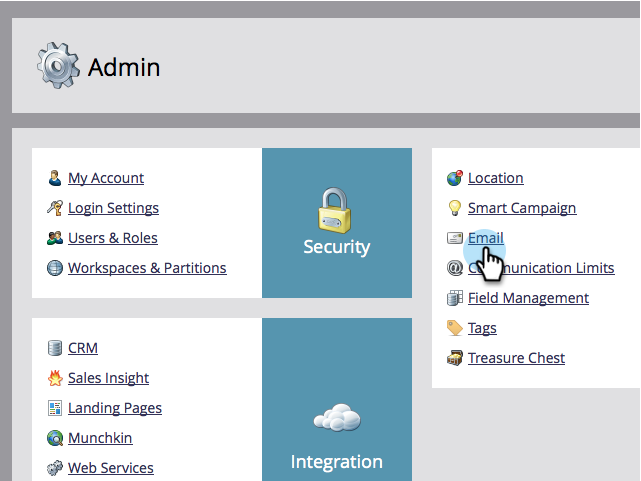

# Cambio de la etiqueta predeterminada Desde correo electrónico y Desde {#change-the-default-from-email-and-from-label}

Cada usuario administrador puede cambiar los valores predeterminados de **[!UICONTROL De correo electrónico]** y **[!UICONTROL De etiqueta]** para que cuando cree nuevos correos electrónicos, se utilicen esos valores predeterminados.

>[!NOTE]
>
>**Se requieren permisos de administrador**

1. Vaya a la sección **[!UICONTROL Admin]**.

   

1. Haga clic en **[!UICONTROL Correo electrónico]**.

   

1. Escriba los valores predeterminados que desee para **[!UICONTROL De correo electrónico]** y **[!UICONTROL De etiqueta]**, y después haga clic en **[!UICONTROL Guardar cambios]**.

   

>[!NOTE]
>
>El cambio solo se aplica a usted y no a otros usuarios de Marketo.

Ahora, cada vez que cree un nuevo correo electrónico, se utilizarán los valores predeterminados establecidos.
