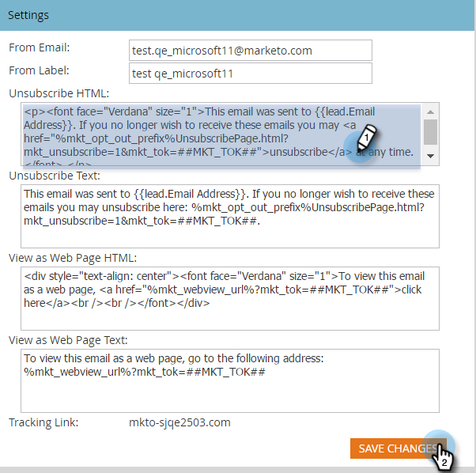

# Editar el mensaje de cancelación de suscripción {#edit-the-unsubscribe-message}

>[!NOTE]
>
>**Se requieren permisos de administrador**

Al enviar correos electrónicos de marketing (que no sean[operativa](/help/marketo/product-docs/email-marketing/general/functions-in-the-editor/make-an-email-operational.md)), el texto de cancelación de la suscripción y los vínculos se anexan a la parte inferior. Puede cambiar los valores predeterminados. Así es como.

## Dónde realizar la edición {#where-to-make-the-edit}

1. Vaya a la **Administrador** para obtener más información.

   

1. Haga clic en **Correo electrónico**.

   

   >[!CAUTION]
   >
   >Las siguientes variables son críticas. ¡No los borres!
   >
   >* `%mkt_opt_out_prefix%`
   >* `mkt_unsubscribe=1&mkt_tok=##MKT_TOK##`

1. Edite el **Cancelar suscripción al HTML** y **Cancelar suscripción de texto** versiones a su gusto y haga clic en **Guardar cambios**.

   

   Ahí lo tienes. _¡Asegúrate de probar!_ No desea que sus correos electrónicos de marketing tengan vínculos de cancelación de suscripción rotos.

>[!TIP]
>
>Puede personalizar la posición del HTML de cancelación de suscripción en su correo electrónico utilizando [tokens](/help/marketo/product-docs/email-marketing/general/using-tokens/add-a-system-token-as-a-link-in-an-email.md).

## Texto predeterminado de cancelación de suscripción {#default-unsubscribe-text}

Si alguna vez necesita volver a la cancelación de suscripción predeterminada del sistema, copie/pegue lo siguiente:

HTML de cancelación de suscripción:
`<pre data-theme="Confluence">
If you no longer wish to receive these emails, click on the following link: <a href="%mkt_opt_out_prefix%UnsubscribePage.html?mkt_unsubscribe=1&mkt_tok=##MKT_TOK##">Unsubscribe</a> 
</pre>` Cancelar suscripción de texto:
`<pre data-theme="Confluence">%mkt_opt_out_prefix%UnsubscribePage.html?mkt_unsubscribe=1&mkt_tok=##MKT_TOK##</pre>`

>[!MORELIKETHIS]
>
>[Editar el mensaje &quot;Ver como página web&quot;](/help/marketo/product-docs/administration/email-setup/edit-the-view-as-web-page-message.md)
