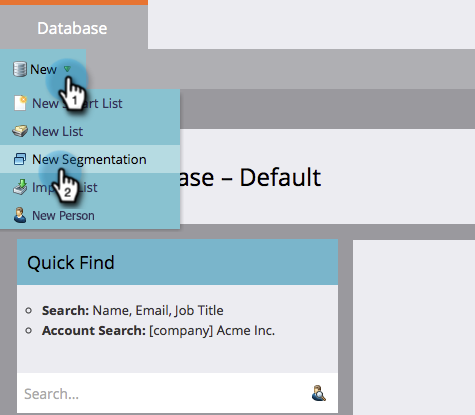
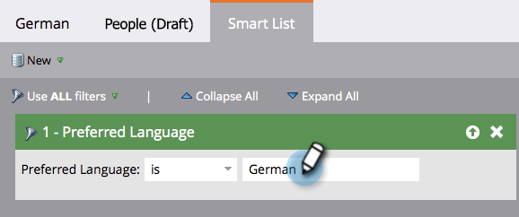
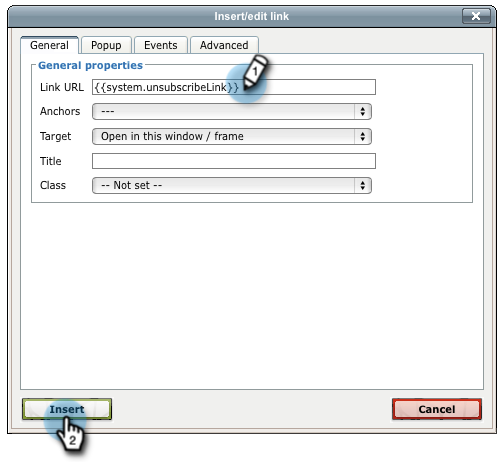
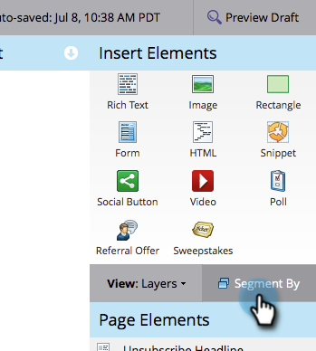

# Conversión de su mensaje de cancelación de suscripción en dinámico para idiomas {#make-your-unsubscribe-message-dynamic-for-languages}

El mensaje y el vínculo predeterminados de cancelación de suscripción están en inglés. Puede utilizar contenido dinámico para mostrarlo en distintos idiomas.

>[!NOTE]
>
>Hemos preparado este pequeño tutorial para usted. Representa una práctica recomendada, pero esto puede lograrse de otras maneras.

## Preparar los datos {#prepare-your-data}

1. [Cree un ](/help/marketo/product-docs/administration/field-management/create-a-custom-field-in-marketo.md) campo personalizado denominado &quot;Idioma preferido&quot;. (Configúrelo en su CRM si desea sincronizar este campo).

   >[!TIP]
   >
   >En el futuro, utilice este campo cuando [cree un formulario](/help/marketo/product-docs/demand-generation/forms/creating-a-form/create-a-form.md) para capturar las preferencias de idioma.

## Crear segmentación {#create-segmentation}

1. Vaya a la **Base de datos**.

   

1. En la lista desplegable **Nuevo**, haga clic en **Nueva segmentación**.

   

1. Asigne un nombre al **Idioma preferido** de la segmentación. Haga clic en **Añadir segmento**. Escriba un idioma.

   

   >[!NOTE]
   >
   >El segmento predeterminado será inglés.

1. Continúe agregando segmentos hasta que se representen todos los idiomas. Haga clic en **Crear**.

   

1. Seleccione un segmento.

   

1. Vaya a la ficha **Lista inteligente**. Escriba **Idioma preferido** en el campo de búsqueda. Arrastre y suelte el filtro en el lienzo.

   

1. Configure el idioma correspondiente correspondiente.

   

1. Repita el proceso para todos los idiomas diferentes. A continuación, seleccione la lista desplegable **Acciones de segmentación** y haga clic en **Aprobar**.

   

## Crear un fragmento de código {#create-a-snippet}

1. Vaya a **Design Studio**.

   

1. En la lista desplegable **Nuevo**, haga clic en **Nuevo fragmento**.

   

1. Asigne un nombre al fragmento de código **Mensaje de cancelación de suscripción**. Haga clic en **Crear**.

   

1. Escriba el mensaje predeterminado de cancelación de suscripción, resalte el mensaje y haga clic en el icono de hipervínculo.

   

1. Copie y pegue este token: `{{system.unsubscribeLink}}` en el campo **URL del vínculo**. Haga clic en **Insertar**.

   

1. Seleccione **Segmentar por** en la sección Segmentación.

   

1. En la lista desplegable Segmentación, escriba **Preferred** y seleccione **Preferred Language**. Haga clic en **Guardar**.

   

1. Seleccione un segmento del árbol. Escriba su mensaje de cancelación de suscripción en ese idioma.

   

1. Copie y pegue el mismo token: `{{system.unsubscribeLink}}` en el campo **URL del vínculo**. Haga clic en **Insertar**.

   

1. Repita el proceso para todos los segmentos. A continuación, vuelva a Design Studio, haga clic en la lista desplegable **Acciones de fragmento** y haga clic en **Aprobar**.

   

   Increíble. Casi ahí.

## Usar fragmento de código en un mensaje de correo electrónico {#use-snippet-in-an-email}

1. Dentro del editor de correo electrónico, haga clic en el elemento editable. A continuación, haga clic en el icono de engranaje y seleccione **Reemplazar con fragmento**. Si está seleccionando un elemento de fragmento editable, haga clic en el icono de engranaje y seleccione **Editar**.

   

1. Busque y seleccione el fragmento en la lista desplegable y haga clic en **Guardar**.

   

1. Para probarlo, haga clic en **Atrás**...

   

1. ...a continuación, la ficha **Dynamic**.

   

1. Haga clic en los distintos idiomas para ver el cambio de fragmento.

   

   >[!TIP]
   >
   >Por supuesto, también puede editar el resto del correo electrónico para el lenguaje dinámico. Mientras esté en él, realice la misma técnica en la página de cancelación de suscripción.

## Personalización de la página de cancelación de suscripciones con contenido dinámico {#customizing-your-unsubscribe-page-with-dynamic-content}

Si desea que su gente venga a una página de cancelación de suscripción en su idioma preferido, puede utilizar contenido dinámico en la página de aterrizaje y en la página de confirmación.

1. Vaya a Design Studio.

   

1. Escriba _Cancelar suscripción_ en el campo de búsqueda. Debería encontrar sus páginas de cancelación de suscripción.

   

1. Haga clic en **Editar borrador**.

   

1. Seleccione **Segmento por**.

   

1. Busque el segmento Idioma preferido. Haga clic en **Guardar**.

   

   Edite su contenido para cada página de aterrizaje, apruebe, ¡y ya está listo!

   >[!NOTE]
   >
   >Obtenga más información sobre [contenido dinámico](/help/marketo/product-docs/personalization/segmentation-and-snippets/segmentation/understanding-dynamic-content.md) y todo lo interesante que puede hacer.
