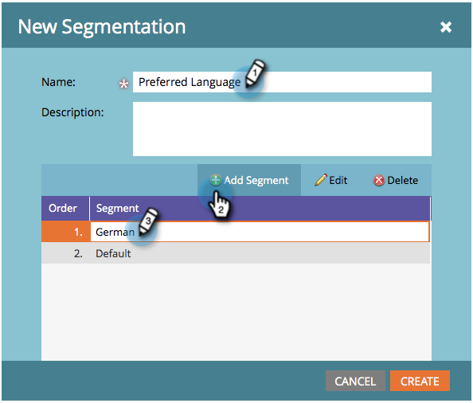

# Dynamic el mensaje de cancelación de suscripción para idiomas {#make-your-unsubscribe-message-dynamic-for-languages}

El mensaje y vínculo predeterminados para darse de baja están en inglés. Puede utilizar contenido dinámico para mostrarlo en distintos idiomas.

>[!NOTE]
>
>Este artículo representa una práctica recomendada, pero se puede realizar de otras maneras.

## Preparar los datos {#prepare-your-data}

1. [Creación de un campo personalizado](/help/marketo/product-docs/administration/field-management/create-a-custom-field-in-marketo.md) se denomina &quot;Idioma preferido&quot;. (Configúrelo en su CRM si desea que este campo se sincronice).

   >[!TIP]
   >
   >Más adelante, utilice este campo cuando [crear un formulario](/help/marketo/product-docs/demand-generation/forms/creating-a-form/create-a-form.md) para capturar las preferencias de idioma.

## Crear segmentación {#create-segmentation}

1. Vaya a la **Base de datos**.

   

1. En el **Nuevo** desplegable, haga clic en **Nueva segmentación**.

   

1. Asigne un nombre a la segmentación **Idioma preferido**. Haga clic en **Añadir segmento**. Escriba un idioma.

   

   >[!NOTE]
   >
   >El segmento predeterminado será inglés.

1. Siga agregando segmentos hasta que se representen todos sus idiomas. Haga clic en **Crear**.

   

1. Seleccione un segmento.

   

1. Vaya a la **Lista inteligente** pestaña . Entrar **Idioma preferido** en el campo de búsqueda. Arrastre y suelte el filtro en el lienzo.

   

1. Defina el idioma correspondiente correspondiente.

   

1. Repita el proceso para todos sus idiomas. A continuación, seleccione la **Acciones de segmentación** y haga clic en **Aprobar**.

   

## Crear un fragmento {#create-a-snippet}

1. Vaya a la **Design Studio**.

   

1. En el **Nuevo** menú desplegable, haga clic en **Nuevo fragmento**.

   

1. Asigne un nombre al fragmento **Dar de baja un mensaje**. Haga clic en **Crear**.

   

1. Escriba el mensaje predeterminado de cancelación de suscripción, resalte el mensaje y haga clic en el icono de hipervínculo.

   

1. Copie y pegue este token: `{{system.unsubscribeLink}}` en el **URL** campo . Haga clic en **Insertar**.

   

1. Select **Segmentar por** en la sección Segmentación .

   

1. En la lista desplegable Segmentación , escriba **Preferido** y seleccione **Idioma preferido**. Haga clic en **Guardar**.

   

1. Seleccione un segmento del árbol. Haga clic en su cancelación de suscripción y luego en el icono del vínculo .

   

1. Asegúrese de `{{system.unsubscribeLink}}` sigue en el campo URL . Edite Mostrar texto para que coincida con el idioma seleccionado. Haga clic en **Aplicar**.

   

1. Repita el proceso para todos los segmentos. A continuación, vuelva a Design Studio y haga clic en el **Acciones de fragmento** y haga clic en **Aprobar**.

   

Increíble. ¡Casi ahí!

## Utilizar fragmento de código en un correo electrónico {#use-snippet-in-an-email}

1. Dentro del editor de correo electrónico, haga clic en el elemento editable . A continuación, haga clic en el icono de engranaje y seleccione **Reemplazar con fragmento**. Si está seleccionando un elemento de fragmento editable, haga clic en el icono de engranaje y seleccione **Editar**.

   

1. Busque y seleccione el fragmento en la lista desplegable y haga clic en **Guardar**.

   

1. Para probarlo, haga clic en **Atrás**...

   

1. ...a continuación, la variable **Dinámica** pestaña .

   

1. Haga clic en los distintos idiomas para ver el cambio de fragmento.

   

   >[!TIP]
   >
   >Por supuesto, también puede editar el resto del correo electrónico para el lenguaje dinámico. Mientras esté en él, realice la misma técnica en la página de cancelación de suscripción.

## Personalización de la página de cancelación de suscripción con contenido dinámico {#customizing-your-unsubscribe-page-with-dynamic-content}

Si desea que sus usuarios vayan a una página de cancelación de suscripción en su idioma preferido, puede utilizar contenido dinámico en la página de aterrizaje y la página de confirmación.

1. Vaya a la **Design Studio**.

   

1. Escriba en _Cancelar suscripción_ en el campo de búsqueda y seleccione la página de cancelación de suscripción que desee.

   

1. Haga clic en **Editar borrador**.

   

1. Select **Segmentar por**.

   

1. Busque el segmento Idioma preferido . Haga clic en **Guardar**.

   

   Edite el contenido de cada página de aterrizaje, apruebe y ya estará listo.

   >[!NOTE]
   >
   >Más información sobre [contenido dinámico](/help/marketo/product-docs/personalization/segmentation-and-snippets/segmentation/understanding-dynamic-content.md) y todas las cosas geniales que puedes hacer.
