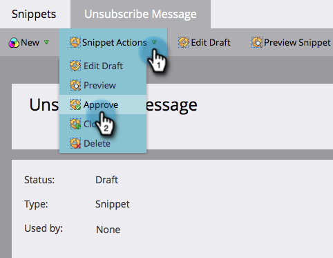

# Haga que el mensaje de cancelación de suscripción sea dinámico para idiomas {#make-your-unsubscribe-message-dynamic-for-languages}

El mensaje y el vínculo predeterminados para cancelar la suscripción están en inglés. Puede utilizar el contenido dinámico para mostrarlo en diferentes idiomas.

>[!NOTE]
>
>Este artículo representa una práctica recomendada, pero se puede realizar de otras maneras.

## Preparación de los datos {#prepare-your-data}

1. [Cree un campo personalizado](/help/marketo/product-docs/administration/field-management/create-a-custom-field-in-marketo.md) con el nombre &quot;Idioma preferido&quot;. (Configúrelo en su CRM si desea que este campo se sincronice).

   >[!TIP]
   >
   >En el futuro, utilice este campo cuando [cree un formulario](/help/marketo/product-docs/demand-generation/forms/creating-a-form/create-a-form.md) para capturar las preferencias de idioma.

## Crear segmentación {#create-segmentation}

1. Ir a **[!UICONTROL Base de datos]**.

   

1. En el menú desplegable **[!UICONTROL Nuevo]**, haga clic en **[!UICONTROL Nueva segmentación]**.

   

1. Asigne un nombre a la segmentación **[!UICONTROL Idioma preferido]**. Haga clic en **[!UICONTROL Agregar segmento]**. Escriba en un idioma.

   

   >[!NOTE]
   >
   >El segmento predeterminado será el inglés.

1. Continúe añadiendo segmentos hasta que se representen todos los idiomas. Haga clic en **[!UICONTROL Crear]**.

   

1. Seleccione un segmento.

   

1. Vaya a la ficha **[!UICONTROL Lista inteligente]**. Escriba **[!UICONTROL Idioma preferido]** en el campo de búsqueda. Arrastre y suelte el filtro en el lienzo.

   

1. Configure el idioma correspondiente adecuado.

   

1. Repita el proceso para todos los idiomas. A continuación, seleccione la lista desplegable **[!UICONTROL Acciones de segmentación]** y haga clic en **[!UICONTROL Aprobar]**.

   

## Crear un fragmento {#create-a-snippet}

1. Vaya a **[!UICONTROL Design Studio]**.

   

1. En el menú desplegable **[!UICONTROL Nuevo]**, haga clic en **[!UICONTROL Nuevo fragmento]**.

   

1. Asigne un nombre al fragmento **Mensaje de cancelación de suscripción**. Haga clic en **[!UICONTROL Crear]**.

   

1. Escriba el mensaje de cancelación de suscripción predeterminado, resáltelo y haga clic en el icono de hipervínculo.

   

1. Copie y pegue este token: `{{system.unsubscribeLink}}` en el campo **[!UICONTROL URL]**. Haga clic en **[!UICONTROL Insertar]**.

   

1. Seleccione **[!UICONTROL Segmentar por]** en la sección **[!UICONTROL Segmentación]**.

   

1. En el menú desplegable **[!UICONTROL Segmentación]**, escriba **[!UICONTROL Preferido]** y seleccione **[!UICONTROL Idioma preferido]**. Haga clic en **[!UICONTROL Guardar]**.

   

1. Seleccione un segmento del árbol. Haga clic en su cancelación de suscripción y luego en el icono de enlace.

   

1. Asegúrese de que `{{system.unsubscribeLink}}` se encuentre todavía en el campo **[!UICONTROL URL]**. Edite **[!UICONTROL Mostrar texto]** para que coincida con el idioma seleccionado. Haga clic en **[!UICONTROL Aplicar]**.

   

1. Repita el proceso para todos los segmentos. A continuación, vuelva a **[!UICONTROL Design Studio]**, haga clic en la lista desplegable **[!UICONTROL Acciones de fragmento]** y haga clic en **[!UICONTROL Aprobar]**.

   

Fantástico. ¡Ya casi está!

## Usar fragmento de código en un correo electrónico {#use-snippet-in-an-email}

1. Dentro del editor de correo electrónico, haga clic en el elemento editable. A continuación, haga clic en el icono de engranaje y seleccione **[!UICONTROL Reemplazar con fragmento]**. Si está seleccionando un elemento de fragmento editable, haga clic en el icono de engranaje y seleccione **[!UICONTROL Editar]**.

   

1. Busque y seleccione su fragmento de código en la lista desplegable y haga clic en **[!UICONTROL Guardar]**.

   

1. Para probarlo, haga clic en **[!UICONTROL Atrás]**...

   

1. ...y luego la ficha **[!UICONTROL Dinámico]**.

   

1. Haga clic en los diferentes idiomas para ver cómo cambia el fragmento.

   

   >[!TIP]
   >
   >Por supuesto, también puede editar el resto del correo electrónico para lenguaje dinámico. Mientras está en ello, realice la misma técnica en la página de cancelación de suscripción.

## Personalización de la página de cancelación de suscripción con contenido dinámico {#customizing-your-unsubscribe-page-with-dynamic-content}

Si desea que sus recursos accedan a una página de cancelación de suscripción en su idioma preferido, puede utilizar contenido dinámico en la página de aterrizaje y en la página de confirmación.

1. Vaya a **[!UICONTROL Design Studio]**.

   

1. Escriba _Cancelar la suscripción_ en el campo de búsqueda y seleccione la página Cancelar la suscripción que desee.

   

1. Haga clic en **[!UICONTROL Editar borrador]**.

   

1. Seleccionar **[!UICONTROL Segmento Por]**.

   

1. Busque el segmento **[!UICONTROL Idioma preferido]**. Haga clic en **[!UICONTROL Guardar]**.

   

   Edite el contenido de cada página de aterrizaje, apruébelo y ya está listo.

   >[!NOTE]
   >
   >Más información sobre [contenido dinámico](/help/marketo/product-docs/personalization/segmentation-and-snippets/segmentation/understanding-dynamic-content.md) y todas las cosas interesantes que puedes hacer.
