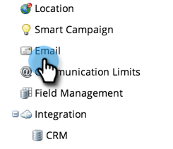

# Editar el mensaje “Ver como página web” {#edit-the-view-as-web-page-message}

Si necesita editar el texto &quot;[Ver como página web](/help/marketo/product-docs/email-marketing/general/functions-in-the-editor/add-a-view-as-web-page-link-to-an-email.md)&quot;, así es.

>[!NOTE]
>
>**Se requieren permisos de administración**

## Editar el mensaje “Ver como página web” {#edit-the-view-as-web-page-message-1}

1. Vaya al área de **[!UICONTROL Admin]**.

   

1. Haga clic en **[!UICONTROL Correo electrónico]**.

   

   >[!CAUTION]
   >
   >Las siguientes variables son críticas. ¡No los borre!
   >
   >`%mkt_webview_url%?mkt_tok=##MKT_TOK##`
   >
   >La segunda parte `##MKT_TOK##` es la cookie [!UICONTROL munchkin] de esa persona. Se asegura de que se les cookies correctamente cuando hacen clic en el vínculo.

1. Edite las versiones de **[!UICONTROL Ver como página web HTML]** y **[!UICONTROL Ver como página web Text]** a su gusto y haga clic en **[!UICONTROL Guardar cambios]**.

   

>[!CAUTION]
>
>Asegúrese de evitar:
>
>* Añadir direcciones URL adicionales a cualquiera de los cuadros de HTML
>* Incluir HTML en la versión de texto

Ahí lo tienes. Envíe correos electrónicos de prueba para garantizar el formato.

## Texto predeterminado de &quot;Ver como página web&quot; {#default-view-as-web-page-text}

Si alguna vez necesita volver al sistema predeterminado &quot;[!UICONTROL Ver como página web]&quot;, copie y pegue lo siguiente:

**[!UICONTROL Ver como HTML de página web]**:

`
To view this email as a web page, <a href="%mkt_webview_url%?mkt_tok=##MKT_TOK##">click here</a>
`

**[!UICONTROL Ver como texto de página web]**:

Para ver este correo electrónico como una página web, vaya a la siguiente dirección:
`%mkt_webview_url%?mkt_tok=##MKT_TOK##`

¡Eso es todo!
