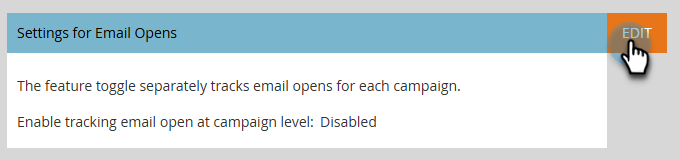
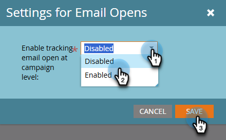

# Seguimiento de aperturas de correo electrónico en el nivel de campaña {#email-open-tracking-at-campaign-level}

Esta función le permite controlar el seguimiento de aperturas por correo electrónico, ya sea una vez para cada apertura de una campaña o solo una vez para cada correo electrónico, independientemente de cuántas veces se utilice en diferentes campañas.

>[!NOTE]
>
>**Se requieren permisos de administrador**

1. Vaya al área de **[!UICONTROL Admin]**.

   

1. Haga clic en **[!UICONTROL Campaña inteligente]**.

   

1. Junto a _Configuración para aperturas de correo electrónico_, haz clic en **[!UICONTROL Editar]**.

   

1. Haga clic en la lista desplegable, elija la configuración que desee y haga clic en **[!UICONTROL Guardar]**.

   

<table><tbody>
  <tr>
    <td><b>Habilitado</b></td>
    <td>El seguimiento de las aperturas de correo electrónico se realiza de forma independiente para cada campaña.</td>
  </tr>
  <tr>
    <td><b>Desactivado</b></td>
    <td>Las aperturas de correo electrónico se cuentan solo en función de las aperturas de personas únicas.</td>
  </tr>
</tbody>
</table>
