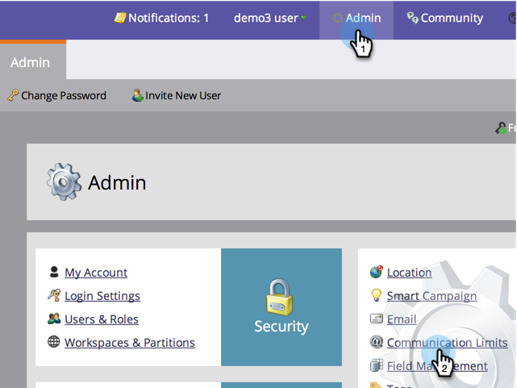

# Habilitar límites de comunicación {#enable-communication-limits}

Es muy importante no comunicar demasiado con tu gente. El establecimiento de límites de comunicación ayudará a evitar que su organización envíe demasiados correos electrónicos.

>[!NOTE]
>
>**Se requieren permisos de administrador**

1. En **Administración**, haga clic en **Límites de comunicación**.

   

1. Haga clic en **Editar**.

   

   >[!NOTE]
   >
   >Por día se basa en el día del calendario en la zona horaria de suscripción (medianoche a medianoche).

1. Haga clic en la lista desplegable **Per Day** y seleccione el límite deseado. En este ejemplo elegimos 1.

   

   >[!TIP]
   >
   >También puede elegir **Personalizado** si ninguna de las opciones preestablecidas funciona por usted.

1. Haga clic en la lista desplegable **Per 7 Days** y seleccione el límite deseado. En este ejemplo elegimos 5.

   

1. Seleccione **Bloquear correos electrónicos no operativos**.

   

   >[!NOTE]
   >
   >Obtenga más información sobre los [correos electrónicos operativos](/help/marketo/product-docs/email-marketing/general/functions-in-the-editor/make-an-email-operational.md).

1. Haga clic en **Guardar**.

   

   >[!NOTE]
   >
   >**Ejemplo**
   >
   >La configuración anterior significa que las personas no recibirán más de **1 correo electrónico al día** o más de **5 en cualquier período de siete días**.

   >[!NOTE]
   >
   >Los límites de comunicación se aplican automáticamente a todos los programas de correo electrónico y participación.

>[!MORELIKETHIS]
>
>[Aplicación de límites de comunicación a una campaña inteligente](/help/marketo/product-docs/core-marketo-concepts/smart-campaigns/using-smart-campaigns/apply-communication-limits-to-smart-campaign.md)
