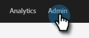
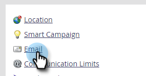

# Filtrar actividad del bot de correo electrónico {#filtering-email-bot-activity}

A veces, la actividad de bots de correo electrónico puede inflar erróneamente los datos de aperturas y clics en correos electrónicos. Siga los pasos a continuación para solucionar esto.

Se utilizan dos métodos independientes para confirmar la actividad de bots:

* Coincidir con [lista de bots interactiva de Advertising Bureau](https://www.iab.com/guidelines/iab-abc-international-spiders-bots-list/){target="_blank"}: Las actividades que coincidan con cualquier cosa en la lista de IAB UA/IP (agente de usuario/dirección IP) se marcarán como bots.
* Hacer coincidir con patrón de proximidad: Cuando se producen dos o más actividades al mismo tiempo (en menos de un segundo), se identifican como bots. Los atributos considerados durante la comparación son:
   * ID de posible cliente (debe ser el mismo)
   * Recurso de correo electrónico (debe ser el mismo)
   * Clic en vínculo o correo electrónico abierto
   * Diferencia horaria (debe ser inferior a un segundo)

Frente a la actividad de clic en vínculo de correo electrónico y de apertura de correo electrónico, los nuevos atributos se rellenarán con los valores siguientes:

* Las actividades identificadas como bots tendrán &quot;Actividad de bots&quot; como &quot;True&quot; y &quot;Patrón de actividad de bots&quot; como patrón/método identificado
* Las actividades identificadas como no bots tendrán &quot;Actividad de bots&quot; como &quot;Falso&quot; y &quot;Patrón de actividad de bots&quot; como &quot;N/D&quot;
* Las actividades que se produjeron antes de que se introdujeran estos atributos tendrán &quot;Actividad de bots&quot; como &quot; &quot; (vacío) y &quot;Patrón de actividad de bots&quot; como &quot; &quot; (vacío)

## Seleccionar tipo de filtro {#select-filter-type}

1. Haga clic en **[!UICONTROL Administrador]**.

   

1. Haga clic en **[!UICONTROL Correo electrónico]**.

   

1. Haga clic en la ficha **[!UICONTROL Actividad de bots]**.

   

1. Hay dos controles deslizantes para elegir. Puede habilitar solo una o ambas. Si habilita **[!UICONTROL Coincidencia con la lista de IAB]**, elija si desea [!UICONTROL registrar la actividad de bots] _o_ [!UICONTROL filtrar la actividad de bots].

   

1. Si habilita **[!UICONTROL Coincidir con el patrón de proximidad]**, elija si desea [!UICONTROL registrar la actividad del bot] _o_ [!UICONTROL filtrar la actividad del bot]. También puede establecer el número de segundos para **Duración entre actividades** (el valor predeterminado es 0, el máximo es 3).

   

>[!NOTE]
>
>Con **Duración entre actividades** establecida en 0 segundos, las actividades de correo electrónico se identificarán como que ocurren exactamente al mismo segundo. Si se producen varias actividades de correo electrónico en el número designado de segundos, se identificarán como actividades de bots.

>[!IMPORTANT]
>
>* Si elige [!UICONTROL Filtrar actividad de bots], es posible que vea una caída en las aperturas de correos electrónicos y en los clics a medida que se eliminan las actividades falsas.

**PASO OPCIONAL**: Para deshabilitar cualquiera de las características, anule la selección del control deslizante correspondiente. Si lo hace, los datos no se restablecen.

>[!TIP]
>
>Utilice los datos de actividad de bots en las listas inteligentes a través de los déclencheur booleano &quot;Es actividad de bots&quot; (sí/no) y &quot;Patrón de actividad de bots&quot; en los filtros &quot;Vínculo en el correo electrónico en el que se hizo clic&quot; y &quot;Abrir correo electrónico&quot;, y &quot;Hace clic en un vínculo en el correo electrónico&quot; y &quot;Abre un correo electrónico&quot;.

## LISTA DE BLOQUEADOS IP {#ip-blocklist}

Marketo ha compilado una lista de direcciones IP responsables de generar millones de participaciones falsas. Como resultado, cualquier participación recibida desde las siguientes IP se filtra automáticamente y no se agrega a su suscripción a Marketo Engage. Esto puede reducir las aperturas de correo electrónico, los clics y otras actividades relacionadas. La lista que figura a continuación puede actualizarse periódicamente.

* 40.94.34.52
* 40.94.34.86
* 52.34.76.65
* 54.70.53.60
* 54.71.187.124
* 60.28.2.248
* 64.235.150.252
* 64.235.153.10
* 64.235.153.2
* 64.235.154.105
* 64.235.154.109
* 64.235.154.140
* 64.74.215.1
* 64.74.215.100
* 64.74.215.138
* 64.74.215.139
* 64.74.215.142
* 64.74.215.146
* 64.74.215.150
* 64.74.215.154
* 64.74.215.158
* 64.74.215.162
* 64.74.215.164
* 64.74.215.166
* 64.74.215.170
* 64.74.215.174
* 64.74.215.176
* 64.74.215.178
* 64.74.215.51
* 64.74.215.56
* 64.74.215.58
* 64.74.215.59
* 64.74.215.86
* 64.74.215.98
* 65.154.226.101
* 66.249.91.149
* 70.42.131.106
* 74.125.217.116
* 74.217.90.250
* 104.129.41.4
* 104.47.55.126
* 104.47.58.126
* 104.47.70.126
* 104.47.73.126
* 104.47.73.254
* 104.47.74.126
* 128.220.160.1
* 155.70.39.101
* 162.129.251.14
* 162.129.251.42
* 208.52.157.204

>[!NOTE]
>
>Cada dirección IP se revisa cuidadosamente antes de agregarse a esta lista, lo que garantiza que solo se bloqueen las direcciones IP más dañinas.
