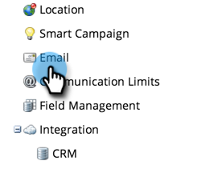
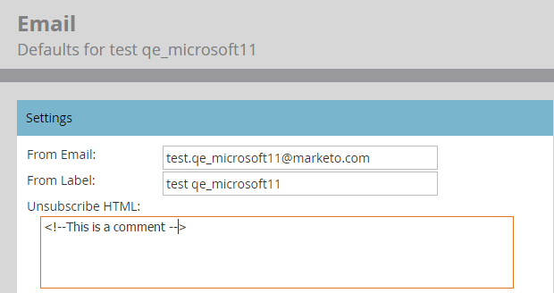

# Quitar texto de cancelación de suscripción {#remove-unsubscribe-text}

La única razón por la que deberías eliminar por completo el contenido de cancelación de suscripción del área de **[!UICONTROL Administración]** > **[!UICONTROL Correo electrónico]** es si eliges crear el vínculo de cancelación de suscripción en las propias plantillas de correo electrónico. El cuadro de texto tiene una validación que no permite guardar sin contenido. Puede evitar esto añadiendo un pequeño comentario en HTML. El comentario de HTML no aparecerá en el cliente de correo electrónico, porque está procesando el correo electrónico en HTML y los comentarios se omiten.

1. Vaya al área de **[!UICONTROL Admin]**.

   

1. Haga clic en **[!UICONTROL Correo electrónico]**.

   

1. Seleccione todo el texto y presione la tecla **[!UICONTROL Delete]**.

   >[!CAUTION]
   >
   >Antes de eliminarlo, copie/pegue esto en un documento de texto como copia de seguridad.

1. Escriba `<!--This is a comment -->`.

   

1. Haga clic en **[!UICONTROL Guardar cambios]**.

   

>[!NOTE]
>
>Para el **texto para cancelar la suscripción**, debe agregar un solo carácter. Utilice un guión o un punto.
