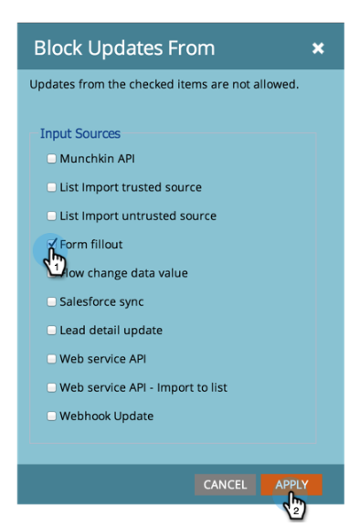

# Bloquear actualizaciones de un campo {#block-updates-to-a-field}

Bloquear actualizaciones en un campo le permite escribir en él una vez y, a continuación, conservar el valor original durante toda la vida del campo. Esto puede resultar útil para un campo como Fuente de persona.

>[!NOTE]
>
>**Se requieren permisos de administrador**

1. Vaya a la **Administrador** .

   

1. Haga clic en **Gestión de las actividades sobre el terreno**.

   

1. Busque el campo , selecciónelo y, a continuación, debajo de **Acciones de campo**, haga clic en **Bloquear actualizaciones de campos**.

   

   >[!NOTE]
   >
   >Puede bloquear las actualizaciones a [Campos personalizados de miembro del programa](/help/marketo/product-docs/core-marketo-concepts/programs/working-with-programs/program-member-custom-fields.md) también.

1. Seleccione el **Fuentes de entrada** desea bloquear y hacer clic en **Aplicar**.

   

   >[!CAUTION]
   >
   >Al realizar una importación de lista, el estado de un campo bloqueado en la vista previa de importación solo se mostrará si Marketo reconoce automáticamente el campo en función del nombre del campo que coincida _Exactamente_ (o si se establecen alias). Si el campo se elige manualmente en la lista desplegable Campo Marketo , el estado bloqueado no se mostrará en la vista previa de importación, pero el bloqueo de actualización a ese campo seguirá implementándose.
