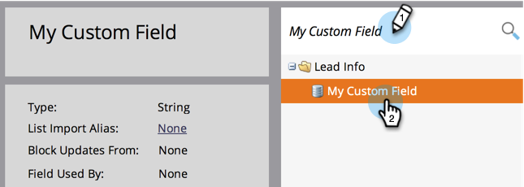

# Cambiar el tipo de un campo personalizado de Marketo {#change-the-type-of-a-marketo-custom-field}

Aprenda a cambiar el tipo de campo de un campo personalizado.

1. Vaya al área de **[!UICONTROL Admin]**.

   

1. Haga clic en **[!UICONTROL Administración de campos]**.

   

1. Busque y seleccione el campo deseado.

   

1. En la lista desplegable **[!UICONTROL Acciones de campo]**, haga clic en **[!UICONTROL Cambiar tipo]**.

   

1. Seleccione el nuevo tipo.

   >[!NOTE]
   >
   >Los campos de puntuación y fórmula no se pueden cambiar.

   

1. Lea la advertencia y haga clic en **[!UICONTROL Cambiar]** para confirmar.

   

   >[!NOTE]
   >
   >El mensaje de advertencia que vea variará según el tipo de campo que esté cambiando de y a.

   >[!MORELIKETHIS]
   >
   >[Crear un campo personalizado en Marketo](/help/marketo/product-docs/administration/field-management/create-a-custom-field-in-marketo.md)
