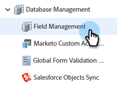

# Creación de un campo personalizado en Marketo {#create-a-custom-field-in-marketo}

Si necesita un nuevo campo personalizado en Marketo Engage para almacenar o capturar datos, así es como crear uno.

1. Vaya a la **[!UICONTROL Administrador]** área.

   

1. Clic **[!UICONTROL Administración de campos]**.

   

   >[!TIP]
   >
   >Si desea que los campos se mantengan sincronizados con su CRM, créelos en el CRM y se crearán automáticamente en Marketo.

1. Clic **[!UICONTROL Nuevo campo personalizado]**.

   

1. Elija el campo Type. Esto cambiará la forma en que se procesa en las listas inteligentes y en los formularios de Marketo.

   >[!TIP]
   >
   >Consulte la [Glosario de tipos de campos personalizados](/help/marketo/product-docs/administration/field-management/custom-field-type-glossary.md).

   

1. Introduzca el [!UICONTROL Nombre] tal como desea que aparezca en Marketo. El [!UICONTROL Nombre de API] se genera automáticamente. Puede modificarlo, pero no se puede cambiar el nombre una vez configurado. Clic **[!UICONTROL Crear]** cuando termine.

>[!CAUTION]
>
>Los nombres de campo no pueden comenzar con los siguientes caracteres: **. &amp; +[]**

>[!NOTE]
>
>El nombre de la API lo utilizan la API de SOAP y otros procesos backend.

Ahora puede utilizar este campo personalizado en formularios, pasos de flujo y listas inteligentes.
