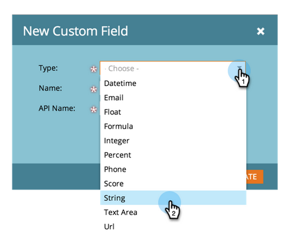

# Creación de un campo personalizado en Marketing {#create-a-custom-field-in-marketo}

Si necesita un nuevo campo personalizado en Marketing para almacenar o capturar datos, así se puede crear uno.

1. Vaya a Administración y haga clic en Administración de campos.

   

   >[!TIP]
   >
   >Si desea que los campos se mantengan sincronizados con su CRM, créelos en la CRM y se crearán automáticamente en Marketing.

1. Haga clic en Nuevo campo personalizado.

   

1. Elija el tipo de campo. Esto cambiará la forma en que se procesa en listas y formularios inteligentes en Marketing Cloud.

   >[!TIP]
   >
   >Consulte el glosario Tipos de campos [personalizados](custom-field-type-glossary.md).

   

1. Introduzca el nombre tal como desea que aparezca en el libro de marketing. El nombre de la API se genera automáticamente. Puede modificarla, pero no se le puede cambiar el nombre una vez configurada. Haga clic en Crear cuando termine.

>[!CAUTION]
>
>Los nombres de campo no pueden tener inicios con los siguientes caracteres: **. &amp; +[]**

>[!NOTE]
>
>El nombre de la API lo utilizan la API de SOAP y otros procesos back-end.

Ahora puede utilizar este campo personalizado en formularios, pasos de flujo y listas inteligentes.