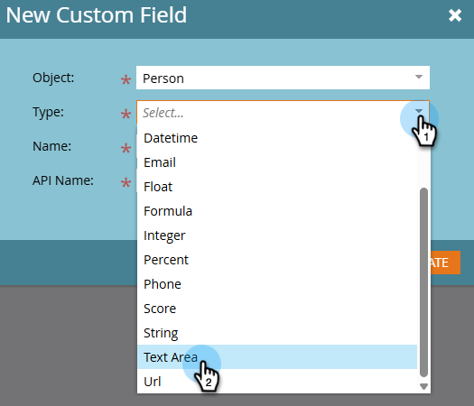

# Creación de un campo personalizado en Marketo {#create-a-custom-field-in-marketo}

Si necesita un nuevo campo personalizado en Marketo Engage para almacenar o capturar datos, así es como crear uno.

1. Vaya al área de **[!UICONTROL Admin]**.

   

1. Haga clic en **[!UICONTROL Administración de campos]**.

   

   >[!TIP]
   >
   >Si desea que los campos se mantengan sincronizados con su CRM, créelos en el CRM y se crearán automáticamente en Marketo.

1. Haga clic en **[!UICONTROL Nuevo campo personalizado]**.

   

1. Elija _[!UICONTROL Objeto]_.

   

   >[!NOTE]
   >
   >Aunque no puede seleccionar el objeto _Company_ usted mismo, puede solicitarlo poniéndose en contacto con el [Soporte técnico de Marketo](https://nation.marketo.com/t5/support/ct-p/Support){target="_blank"}.

1. Elija el campo _[!UICONTROL Type]_. Esto cambiará la forma en que se procesa en las listas inteligentes y en los formularios de Marketo.

   >[!TIP]
   >
   >Consulte el [Glosario de tipos de campos personalizados](/help/marketo/product-docs/administration/field-management/custom-field-type-glossary.md){target="_blank"}.

   

1. Escriba _[!UICONTROL Name]_ tal como desea que aparezca en Marketo (el _[!UICONTROL Nombre de API]_ se genera automáticamente). Elija con cuidado, ya que no se puede cambiar el nombre después de guardar. Haga clic en **[!UICONTROL Crear]** cuando haya terminado.

>[!CAUTION]
>
>Los nombres de campo no pueden comenzar con los siguientes caracteres: **. &amp; +[]**

>[!NOTE]
>
>El nombre de la API lo utilizan la API de SOAP y otros procesos backend.

Ahora puede utilizar este campo personalizado en formularios, pasos de flujo y listas inteligentes.
