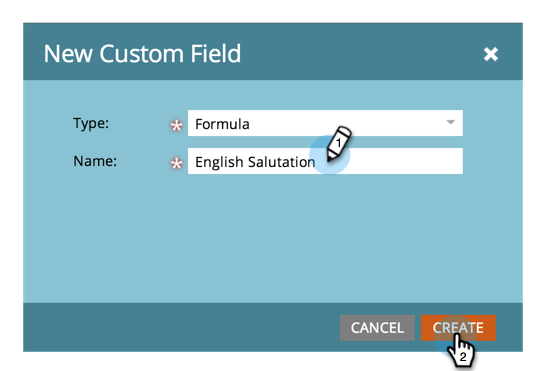

# Crear y utilizar un campo de cadena concatenada (fórmula) {#create-and-use-a-concatenated-string-formula-field}

Puede combinar valores de varios campos o crear un valor condicional mediante un campo de fórmula de Marketo.

1. Vaya a **Administrador** y haga clic en **Gestión de las actividades sobre el terreno**.

   

1. Haga clic en **Nuevo campo personalizado**.

   

1. Select **Fórmula** para el **Tipo**.

   

1. Escriba un **Nombre** para el campo , haga clic en **Crear**.

   

1. Busque y seleccione el campo de fórmula y haga clic en **Editar reglas**.

   

1. Añada dos opciones y defina como la captura de pantalla siguiente.

   

   >[!TIP]
   >
   >Más información sobre [tokens para pasos de flujo](/help/marketo/product-docs/core-marketo-concepts/smart-campaigns/flow-actions/use-tokens-in-flow-steps.md).

1. Ahora puede añadir el campo de fórmula como token en un correo electrónico.

   

>[!NOTE]
>
>Los campos de fórmula se pueden utilizar en páginas de aterrizaje, correos electrónicos y columnas de lista inteligente (no se exportan). Los correos electrónicos con campos de fórmula pueden **not** se envían mediante una campaña por lotes. Utilice un [token de script de correo electrónico](/help/marketo/product-docs/email-marketing/general/using-tokens/create-an-email-script-token.md) en este escenario.

¡Buen trabajo! Ahora tiene un campo inteligente que sabe qué saludo incluir en función del género. Diviértete con esto y sé creativo.
