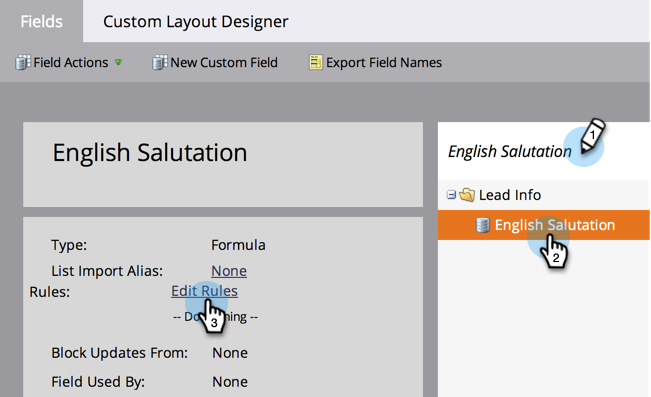

# Crear y utilizar un campo de cadena concatenada (fórmula) {#create-and-use-a-concatenated-string-formula-field}

Puede combinar valores de varios campos o crear un valor condicional mediante un campo de Fórmula de Marketo.

1. Vaya a la **[!UICONTROL Administrador]** área.

   

1. Clic **[!UICONTROL Administración de campos]**.

   

1. Clic **[!UICONTROL Nuevo campo personalizado]**.

   

1. Seleccionar **[!UICONTROL Fórmula]** para el **[!UICONTROL Tipo]**.

   

1. Introduzca una **[!UICONTROL Nombre]** para el campo, haga clic en **[!UICONTROL Crear]**.

   

1. Busque y seleccione el campo de fórmula y haga clic en **[!UICONTROL Editar reglas]**.

   

1. Añada dos opciones y configúrelas como en la captura de pantalla siguiente.

   

   >[!TIP]
   >
   >Más información sobre [tokens para pasos de flujo](/help/marketo/product-docs/core-marketo-concepts/smart-campaigns/flow-actions/use-tokens-in-flow-steps.md).

1. Ahora puede agregar el campo de fórmula como un token en un correo electrónico.

   

>[!NOTE]
>
>Los campos de fórmula se pueden utilizar en páginas de aterrizaje, correos electrónicos y columnas de listas inteligentes (no se exportan). Los correos electrónicos con campos de fórmula pueden _no_ se enviarán mediante una campaña por lotes. Utilice una [token de script de correo electrónico](/help/marketo/product-docs/email-marketing/general/using-tokens/create-an-email-script-token.md) en este escenario.

¡Buen trabajo! Ahora tiene un campo inteligente que sabe qué saludos incluir en función del género. Diviértete con esto y ponte creativo.
