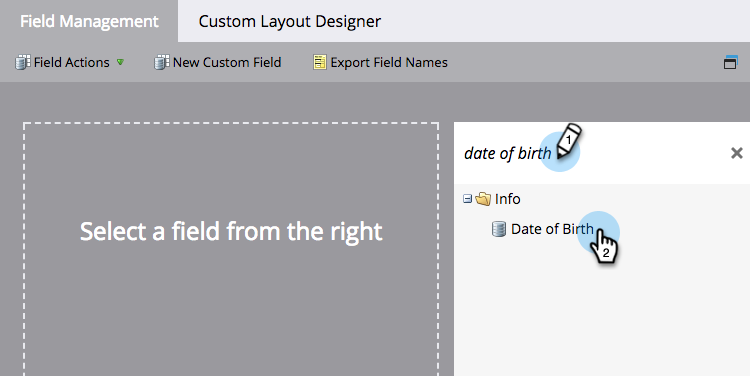

# Editar alias de campo para importar listas {#edit-field-aliases-for-list-import}

Al importar una lista con encabezados desconocidos, puede crear alias de campo para facilitar la tarea. También puede editar esos alias en la administración de campos. Eche un vistazo.

>[!NOTE]
>
>**Permisos de administración necesarios**

1. Vaya a la **[!UICONTROL Administrador]** área.

   

1. Clic **[!UICONTROL Administración de campos]**.

   

1. Busque y seleccione el campo al que desee añadir un alias.

   

1. En el **[!UICONTROL Acciones de campo]** , haga clic en **[!UICONTROL Editar alias de importación]**.

   

1. Introduzca un alias y haga clic en **[!UICONTROL Guardar]**.

   

>[!TIP]
>
>Clic **[!UICONTROL Añadir otro]** e introduzca más alias si los necesita.

¡Mira eso! Ahora, si importa una hoja de cálculo con una columna denominada &quot;DOB&quot;, Marketo la reconocerá automáticamente como &quot;Fecha de nacimiento&quot; e importará los datos en el campo correcto.

