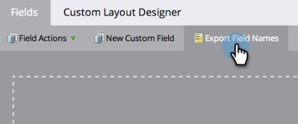

# Exportación de una lista de todos los nombres de campo de la API de Marketo {#export-a-list-of-all-marketo-api-field-names}

Si está usando [!DNL SOAP API] o [!DNL Munchkin API], necesitará una lista de todos sus campos y sus nombres de API.

>[!NOTE]
>
>**Se requieren permisos de administrador**

1. Vaya al área de **[!UICONTROL Admin]**.

   

1. Haga clic en **[!UICONTROL Administración de campos]**.

   

1. Haga clic en **[!UICONTROL Exportar nombres de campo]** para descargar la hoja de cálculo.

   

Ahora tiene una hoja de cálculo con una lista de todos los campos y sus nombres de API.

>[!NOTE]
>
>El límite de caracteres para los nombres de API de MLM es de 255.
