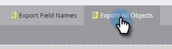

# Exportar todos los metadatos de objeto {#export-all-object-metadata}

Esta función permite exportar todos los objetos y sus metadatos.

>[!NOTE]
>
>**Se requieren permisos de administrador**

## Objetos {#objects}

* Campos de posible cliente (persona/empresa)
* Marketo Personalizar Objetos
* Actividades estándar
* Actividades personalizadas
* Canales
* Etiquetas

## Exportar metadatos de objeto {#export-object-metadata}

1. En My Marketo, haga clic en **Admin**.

   

1. Seleccione **Administración de campos**.

   

1. Haga clic en **Exportar todos los objetos**.

   

>[!NOTE]
>
>Asegúrese de que el navegador no bloquee ventanas emergentes de Marketo.

Los datos se exportarán como CSV.

