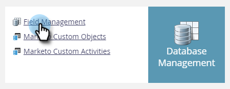

# Exportar todos los metadatos del objeto {#export-all-object-metadata}

Esta función le permite exportar todos los objetos y sus metadatos.

>[!NOTE]
>
>**Se requieren permisos de administración**

## Objetos {#objects}

* Campos de posibles clientes (persona/compañía)
* Objetos personalizables de Marketo
* Actividades estándar
* Actividades personalizadas
* Canales
* Etiquetas

## Exportar metadatos del objeto {#export-object-metadata}

1. Vaya al área de **[!UICONTROL Admin]**.

   

1. Haga clic en **[!UICONTROL Administración de campos]**.

   

1. Haga clic en **[!UICONTROL Exportar todos los objetos]**.

   

>[!NOTE]
>
>Asegúrese de que el explorador no bloquee las ventanas emergentes de Marketo.

Los datos se exportarán como CSV.

