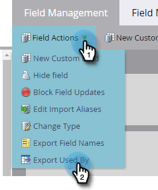

# Exportación utilizada por los datos de un campo {#export-used-by-data-for-a-field}

Como administrador, tiene la capacidad de exportar los recursos relacionados de un campo para poder delegar su desvinculación a su equipo.

>[!NOTE]
>
>**Permisos de administración necesarios**

1. Vaya a la **[!UICONTROL Administrador]** área.

   

1. Clic **[!UICONTROL Administración de campos]**.

   

1. Busque el campo deseado y selecciónelo.

   

1. Haga clic en **[!UICONTROL Acciones de campo]** y seleccione. **[!UICONTROL Exportación utilizada por]**.

   

1. Un [!DNL Excel] se exportará el archivo. Ábralo para ver su contenido.

   

   >[!TIP]
   >
   >Cada recurso relacionado es un vínculo en el que se puede hacer clic y que se abrirá en Marketo.
