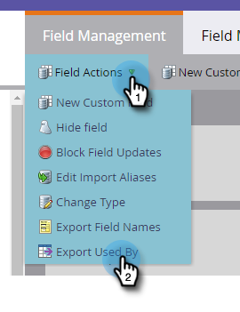

# Exportación utilizada por los datos para un campo {#export-used-by-data-for-a-field}

Como administrador, puede exportar recursos relacionados de un campo para poder delegar su desvinculación en su equipo.

>[!NOTE]
>
>**Se requieren permisos de administrador**

1. Haga clic en **Admin**.

   

1. Haga clic en **Administración de campos**.

   

1. Busque el campo deseado y selecciónelo.

   

1. Haga clic en la lista desplegable **Field Actions** y seleccione **Export used By**.

   

1. Se exportará un archivo de Excel. Ábrala para ver su contenido.

   

   >[!TIP]
   >
   >Cada recurso relacionado es un vínculo en el que se puede hacer clic y se abrirá en Marketo.
