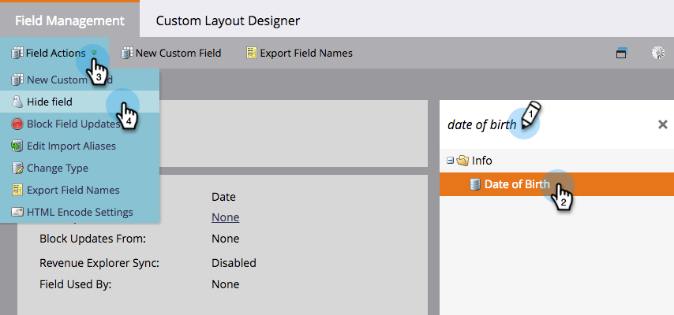
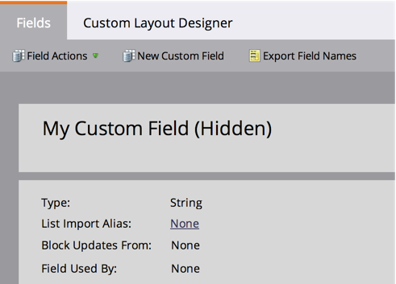

# Ocultar y mostrar un campo {#hide-and-unhide-a-field}

Si ya no tiene uso para un campo en Marketing, puede ocultarlo en la interfaz de usuario para que ya no se muestre en la aplicación.

## Ocultar un campo {#hide-a-field}

>[!NOTE]
>
>**Se requieren permisos de administración**

1. Vaya a **Administración** y haga clic en **Administración de campos**.

   

1. Busque el campo, selecciónelo y, a continuación, en **Acciones de campo** haga clic en **Ocultar campo**.

   

   >[!NOTE]
   >
   >Para ocultar un campo, no debe asociarse con ningún otro activo (incluidos los archivados). Asegúrese de quitar el campo de todas las listas inteligentes, opciones de pasos de flujo, formularios, correos electrónicos, etc., antes de ocultarlo.

1. Haga clic en **Ocultar** para confirmar.

   

   ¡Buen trabajo! Ahora sabe cómo ocultar un campo de la interfaz de usuario de Marketing to.

   

## Mostrar un campo {#unhide-a-field}

1. Vaya a **Administración** y haga clic en **Administración de campos**.

   

1. Busque y seleccione el campo. En la lista desplegable Acciones de campo, haga clic en **Mostrar campo**.

   

   ¡bueno trabajo! Ahora sabe cómo mostrar los campos y volverlos visibles en la interfaz de usuario de Marketing to.

   >[!TIP]
   >
   >¿Necesita que se realice un ocultamiento/revelado masivo? Póngase en contacto con el servicio profesional de marketing: services@marketo.com.
