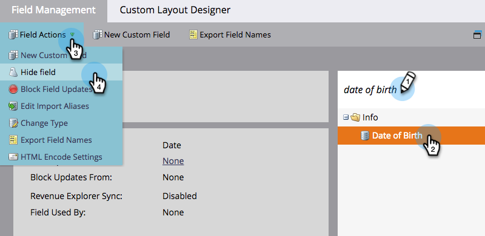

# Ocultar y mostrar un campo {#hide-and-unhide-a-field}

Si ya no necesita un campo en Marketo Engage, puede ocultarlo de la interfaz de usuario para que ya no se muestre en la aplicación.

## Ocultar un campo {#hide-a-field}

>[!NOTE]
>
>**Se requieren permisos de administrador**

1. Vaya al área de **[!UICONTROL Admin]**.

   

1. Haga clic en **[!UICONTROL Administración de campos]**.

   

1. Busque el campo, selecciónelo y, a continuación, en **[!UICONTROL Acciones de campo]**, haga clic en **[!UICONTROL Ocultar campo]**.

   

   >[!NOTE]
   >
   >* Para ocultar un campo, no debe asociarse con ningún otro recurso (incluidos los archivados). Elimine el campo de todas las listas inteligentes, las opciones de pasos de flujo, los formularios, los correos electrónicos, etc., antes de ocultarlo.
   >* No puede ocultar los campos estándar (del sistema).
   >* No se pueden ocultar los campos de información de oportunidad.

1. Haga clic en **[!UICONTROL Ocultar]** para confirmar.

   

   Ahora sabe cómo ocultar un campo de la interfaz de usuario de Marketo.

   

## Mostrar un campo {#unhide-a-field}

1. Vaya al área de **[!UICONTROL Admin]**.

   

1. Haga clic en **[!UICONTROL Administración de campos]**.

   

1. Busque y seleccione el campo. En la lista desplegable [!UICONTROL Acciones de campo], haga clic en **[!UICONTROL Mostrar campo]**.

   

   Ahora sabe cómo mostrar campos y hacerlos visibles de nuevo.
