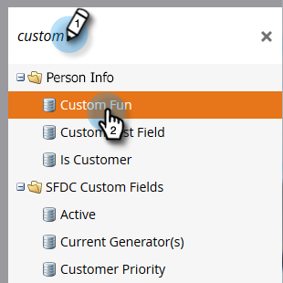
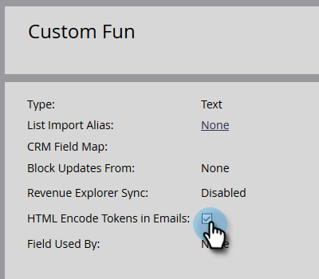

# Tokens de codificación HTML en correos electrónicos {#html-encode-tokens-in-emails}

Habilite o deshabilite los tokens de persona y compañía utilizados en los correos electrónicos.

>[!NOTE]
>
>**Se requieren permisos de administrador**

>[!NOTE]
>
>La codificación convierte los caracteres en sus versiones de código HTML para evitar confusiones cuando se transmiten (por ejemplo, &quot;&amp;&quot; se cambia a `&amp;`). Para obtener más información, consulte con un desarrollador web.

1. Vaya al área de **[!UICONTROL Admin]**.

   

1. Haga clic en **[!UICONTROL Administración de campos]**.

   

1. Busque y seleccione el campo deseado.

   

1. Marque la casilla **[!UICONTROL HTML Encode Tokens in Emails]** para habilitarla y desmárquela para deshabilitarla.

   

   Repita el proceso para cualquier campo adicional que necesite.
