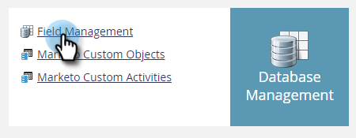

# Marcar un campo como confidencial {#mark-a-field-as-sensitive}

Como administrador de Marketo, puede marcar un campo específico como &quot;sensible&quot; para que sus valores no se rellenen previamente en los formularios, protegiendo así los datos confidenciales de los usuarios.

>[!NOTE]
>
>Esta función se habilitará para todas las instancias de Marketo la tarde del martes 11 de mayo.

1. Haga clic en **Administrador**.

   

1. Haga clic en **Gestión de las actividades sobre el terreno**.

   

1. Busque y seleccione el campo que desee.

   

1. Seleccione el **Marcar campo como confidencial** casilla de verificación.

   

¡Y eso es todo! En adelante, los formularios de Marketo habilitados con relleno previo no mostrarán datos para el campo seleccionado.
