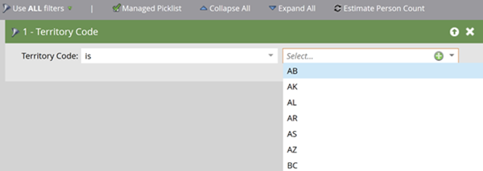

# Administración de listas de selección {#picklist-management}

La administración de listas de selección permite definir un conjunto fijo de valores para un campo con el fin de simplificar la administración de los datos y el flujo de trabajo en Marketo Engage. Solo se pueden administrar en Marketo los campos no textuales que no estén asignados a un campo CRM con una lista de selección definida. Si un campo está asignado a un campo CRM que tiene una lista de selección definida, los valores de ese campo deben definirse en CRM.

Puede ver el estado de una lista de selección desde su página Gestión de Campos. Un campo puede tener uno de los siguientes estados de lista de selección:

* **Administrado**: un usuario ha definido el conjunto de valores que se pueden sugerir automáticamente para este campo. Solo se sugieren automáticamente los valores definidos en la administración de campos. Si se elimina una lista de selección administrada, el estado de la lista de selección vuelve al valor inicial del campo, ya sea No administrada o Predefinida.

* **No administrado**: no se han definido los valores posibles para este campo. Los valores se sugieren automáticamente en función de los que existan en esos campos de la base de datos.

* **Predefinido**: el campo tiene una lista definida por el sistema de valores sugeridos al usuario.

* **CRM**: El campo tiene un valor definido por el sistema CRM, Salesforce.com o Microsoft Dynamics, que se sincroniza con la instancia.

  

## Administrar lista de selección {#manage-picklist}

Para modificar los valores de un campo, vaya a **Administración** > **Administración de campos** y seleccione el campo que desee.

Haga clic en el menú desplegable _Acciones de campo_ y seleccione **Administrar lista de selección**.

En el cuadro de diálogo _Administrar lista de selección_ puede agregar, editar o eliminar valores. También puede eliminar la lista de selección administrada para revertir el campo a su estado de lista de selección original, ya sea _No administrada_ o _Predefinida_.

Cada entrada de la lista de selección tiene un valor para mostrar y un valor enviado. El valor para mostrar es lo que se sugiere al usuario al crear listas inteligentes, campañas inteligentes o formularios, mientras que el valor enviado es el que se almacena. Por ejemplo, el caso de uso Código de territorio puede sugerir el nombre completo de un territorio (por ejemplo, Alberta), mientras almacena el código de dos letras (AB).

## Autosugerir {#autosuggest}

### Cambio entre listas de selección administradas y no administradas {#switching}

La mayoría de las suscripciones de Marketo Engage contienen datos anteriores a la introducción de las listas de selección administradas. Para utilizar valores en listas inteligentes o pasos de flujo de esta lista de selección de versión no administrada (por ejemplo, del conjunto completo de valores que existen en los registros de la base de datos), alterne la configuración Lista de selección administrada en la vista Smart List o Campaign. Cuando está activada, solo se muestran los valores de la lista de selección gestionada. Cuando se desactiva, se utiliza la lista de selección no administrada y los valores se sugieren automáticamente en función de los valores existentes en la base de datos.

### Listas de selección de formularios (Seleccionar campos de tipo) {#form-picklists}

Al igual que las listas de selección predefinidas y administradas por CRM, los valores de las listas de selección administradas se propagan a Forms al utilizar el tipo de campo Seleccionar. Para un campo con una lista de selección administrada, seleccione ese campo y establezca el Tipo de campo en _Seleccionar_.

Muestra el conjunto de valores de listas de selección gestionadas definidos para ese campo.

