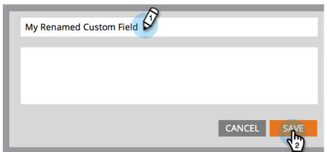

# Cambiar el nombre del campo {#rename-a-field}

>[!NOTE]
>
>Puede cambiar el nombre de un campo personalizado en Marketo. Sin embargo, debe eliminar todo su uso en el sistema antes de hacerlo. Esto incluye formularios, listas inteligentes y campañas inteligentes.

>[!NOTE]
>
>**Se requieren permisos de administrador**

1. Vaya al área de **[!UICONTROL Admin]**.

   

1. Haga clic en **[!UICONTROL Administración de campos]**.

   

1. Busque y seleccione el campo al que desee cambiar el nombre y, a continuación, haga clic en el nombre del campo en el lienzo.

   

   >[!TIP]
   >
   >Haga clic en el vínculo **[!UICONTROL Utilizado por]** para buscar los recursos que hacen referencia a este campo.

1. Cambie el nombre del campo y haga clic en **[!UICONTROL Guardar]**.

   

Ahora sabe cómo cambiar el nombre de los campos en Marketo.

>[!CAUTION]
>
>Si cambia el nombre de la API en [!DNL Salesforce], Marketo creará un campo completamente nuevo y dejará atrás el anterior.
