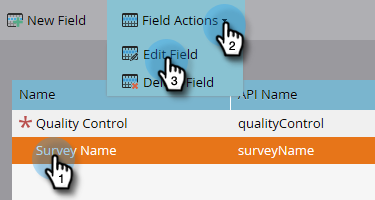

# Agregar, editar o eliminar campos de actividad personalizados de Marketo {#add-edit-delete-marketo-custom-activity-fields}

Obtenga información sobre cómo agregar, cambiar o quitar un campo de actividad personalizado.

## Añadir un campo de actividad personalizado {#add-a-custom-activity-field}

1. Vaya al área de **[!UICONTROL Admin]**.

   

1. Haga clic en **[!UICONTROL Actividades personalizadas de Marketo]**.

   

1. Haga clic en **[!UICONTROL Campos]**.

   

1. Seleccione la actividad personalizada a la que desee añadir un campo.

   

1. Haga clic en **[!UICONTROL Nuevo campo]**.

   

1. Elija [!UICONTROL tipo de datos] del campo.

   

   >[!TIP]
   >
   >Para ver las definiciones de todos los tipos de datos disponibles, vea [este artículo](/help/marketo/product-docs/administration/field-management/custom-field-type-glossary.md).

1. Asigne un nombre al campo [!UICONTROL Nombre de API] se rellena automáticamente. Cuando termine, haga clic en **[!UICONTROL Guardar]**.

   

   Se ha añadido su nuevo campo.

## Editar un campo de actividad personalizado {#edit-a-custom-activity-field}

1. Vaya al área de **[!UICONTROL Admin]**.

   

1. Haga clic en **[!UICONTROL Actividades personalizadas de Marketo]**.

   

1. Haga clic en **[!UICONTROL Campos]**.

   

1. Seleccione la actividad personalizada que contiene el campo que desea editar.

   

1. Seleccione el campo que desea editar, haga clic en la lista desplegable **[!UICONTROL Acciones de campo]** y seleccione **[!UICONTROL Editar campo]**.

   

   Aparecerá la ventana emergente **[!UICONTROL Editar campo]**. En este ejemplo, se cambia el nombre del campo.

   

1. Escriba el nuevo nombre y [!UICONTROL Nombre de API], luego haga clic en **[!UICONTROL Guardar]**.

   

   >[!NOTE]
   >
   >[!UICONTROL Nombre de API] no se rellenará automáticamente al editar un campo. Aunque no es necesario que el campo [!UICONTROL Name] y [!UICONTROL API Name] coincidan, Marketo recomienda que lo hagan.

   >[!CAUTION]
   >
   >Solo puede editar [!UICONTROL Nombre de API] o cambiar el campo a Principal si la actividad personalizada nunca se ha publicado.

   >[!NOTE]
   >
   >Si desea cambiar qué campo es Principal, primero debe deseleccionar el existente.

Se ha actualizado el campo.

## Eliminar un campo de actividad personalizado {#delete-a-custom-activity-field}

1. Vaya al área de **[!UICONTROL Admin]**.

   

1. Haga clic en **[!UICONTROL Actividades personalizadas de Marketo]**.

   

1. Haga clic en **[!UICONTROL Campos]**.

   

1. Seleccione la actividad personalizada que contiene el campo que desea eliminar.

   

1. Seleccione el campo que desea eliminar, haga clic en la lista desplegable **[!UICONTROL Acciones de campo]** y seleccione **[!UICONTROL Eliminar campo]**.

   
