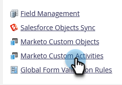

# Agregar/Editar/Eliminar campos de actividad personalizados de Marketo {#add-edit-delete-marketo-custom-activity-fields}

Es posible que tenga que agregar, cambiar o incluso eliminar un campo de actividad personalizado. Así es como.

## Añadir un campo de actividad personalizado {#add-a-custom-activity-field}

1. Vaya a la **[!UICONTROL Administrador]** área.

   

1. Clic **[!UICONTROL Actividades personalizadas de Marketo]**.

   

1. Clic **[!UICONTROL Campos]**.

   

1. Seleccione la actividad personalizada a la que desee añadir un campo.

   

1. Clic **[!UICONTROL Nuevo campo]**.

   

1. Elija el del campo [!UICONTROL tipo de datos].

   

   >[!TIP]
   >
   >¿No está seguro de qué seleccionar? ¡Te tenemos cubierto! Todos los tipos de datos disponibles se definen en [este artículo](/help/marketo/product-docs/administration/field-management/custom-field-type-glossary.md).

1. Asigne un nombre al campo El Nombre de la API se rellena automáticamente. Cuando haya terminado, haga clic en **[!UICONTROL Guardar]**.

   

   ¡Eso es todo! Se ha añadido su nuevo campo.

## Editar un campo de actividad personalizado {#edit-a-custom-activity-field}

1. Vaya a la **[!UICONTROL Administrador]** área.

   

1. Clic **[!UICONTROL Actividades personalizadas de Marketo]**.

   

1. Clic **[!UICONTROL Campos]**.

   

1. Seleccione la actividad personalizada que contiene el campo que desea editar.

   

1. Seleccione el campo que desea editar y haga clic en el **[!UICONTROL Acciones de campo]** y seleccione... **[!UICONTROL Editar campo]**.

   

   Aparecerá la ventana emergente Editar campo. En este ejemplo, vamos a cambiar el nombre del campo.

   

1. Introduzca el nuevo nombre y el nombre de la API y haga clic en **[!UICONTROL Guardar]**.

   

   >[!NOTE]
   >
   >El nombre de la API no se rellenará automáticamente al editar un campo. Aunque no es obligatorio que el nombre de campo y el nombre de la API coincidan, recomendamos que lo hagan.

   >[!CAUTION]
   >
   >Solo puede editar el Nombre de la API o cambiar el campo a Principal si la actividad personalizada nunca se ha publicado.

   >[!NOTE]
   >
   >Si desea cambiar qué campo es Principal, primero debe deseleccionar el existente.

El campo se ha editado.

## Eliminar un campo de actividad personalizado {#delete-a-custom-activity-field}

1. Vaya a la **[!UICONTROL Administrador]** área.

   

1. Clic **[!UICONTROL Actividades personalizadas de Marketo]**.

   

1. Clic **[!UICONTROL Campos]**.

   

1. Seleccione la actividad personalizada que contiene el campo que desea eliminar.

   

1. Seleccione el campo que desee eliminar y haga clic en el **[!UICONTROL Acciones de campo]** y seleccione... **[!UICONTROL Eliminar campo]**.

   
