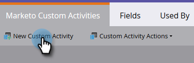

# Crear una actividad personalizada {#create-a-custom-activity}

Siga estos pasos para crear una nueva actividad personalizada.

>[!NOTE]
>
>La mayoría de las suscripciones tienen asignado un límite de 10 tipos de actividades personalizadas.

1. Haga clic en **Admin**.

   

1. En **Administración de bases de datos**, haga clic en **Actividades personalizadas**.

   

1. Haga clic en **Nueva actividad personalizada**.

   

1. Escriba un nombre y una descripción opcional y haga clic en **Siguiente**. El nombre de la API se rellena automáticamente, pero se puede personalizar.

   

   >[!CAUTION]
   >
   >Si decide cambiar el nombre de la API, asegúrese de que el nombre no entre en conflicto con los campos de otras actividades personalizadas.

1. Defina su **Filtro** y **Déclencheur** y haga clic en **Siguiente**.

   

1. Asigne un nombre al campo principal que resuma para qué es la actividad personalizada.

   

   ¡Y eso es todo!

>[!MORELIKETHIS]
>
>[Comprender las actividades personalizadas](/help/marketo/product-docs/administration/marketo-custom-activities/understanding-custom-activities.md)
