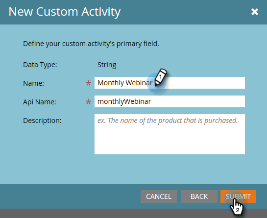

# Creación de una actividad personalizada {#create-a-custom-activity}

Siga estos pasos para crear una nueva actividad personalizada.

>[!NOTE]
>
>La mayoría de las suscripciones tienen un límite asignado de 10 tipos de actividades personalizadas.

1. Vaya al área de **[!UICONTROL Admin]**.

   

1. Haga clic en **[!UICONTROL Actividades personalizadas de Marketo]**.

   

1. Haga clic en **[!UICONTROL Nueva actividad personalizada]**.

   

1. Escriba un nombre y una [!UICONTROL Descripción] opcional y, a continuación, haga clic en **[!UICONTROL Siguiente]**. El nombre de la API se rellena automáticamente, pero se puede personalizar.

   

   >[!CAUTION]
   >
   >Si decide cambiar el [!UICONTROL Nombre de API], asegúrese de que el nombre no entre en conflicto con los campos de otras actividades personalizadas.

1. Defina su [!UICONTROL Déclencheur] y [!UICONTROL filtro] y haga clic en **[!UICONTROL Siguiente]**.

   

1. Asigne un **[!UICONTROL Nombre]** al campo principal que resuma el propósito de la actividad personalizada.

   

>[!MORELIKETHIS]
>
>[Explicación de las actividades personalizadas](/help/marketo/product-docs/administration/marketo-custom-activities/understanding-custom-activities.md)
