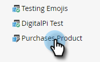

# Exportación de metadatos de actividad personalizada {#custom-activity-metadata-export}

Siga los pasos a continuación para exportar el esquema de metadatos de actividad personalizado.

1. En Mi Marketo, haga clic en **Admin**.

   

1. Haga clic en **Actividades personalizadas de Marketo**.

   

1. Seleccione la actividad personalizada de Marketo que desee exportar.

   

1. Haga clic en la lista desplegable **Acciones de actividad personalizadas** y seleccione **Exportar actividad**.

   

>[!NOTE]
>
>La actividad personalizada debe estar en el estado Aprobado para poder exportarse.

Ahora tiene una hoja de cálculo con el esquema de la actividad personalizada en tres fichas.
