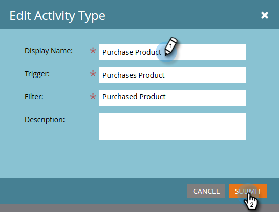

# Edición de una actividad personalizada {#edit-a-custom-activity}

Para realizar cambios en una actividad personalizada que ya se ha creado, siga los pasos a continuación.

1. Vaya al área de **[!UICONTROL Admin]**.

   

1. Haga clic en **[!UICONTROL Actividades personalizadas de Marketo]**.

   

1. Seleccione la actividad personalizada que desee editar.

   

1. Haga clic en **[!UICONTROL Acciones de actividad personalizadas]** y seleccione **[!UICONTROL Editar actividad]**.

   

   Aparecerá Editar tipo de actividad. En este ejemplo, se está corrigiendo un error tipográfico.

   

1. Escriba la información actualizada y haga clic en **[!UICONTROL Enviar]**.

   

   Se ha actualizado la actividad personalizada.

   >[!NOTE]
   >
   >Si su actividad era un borrador en el momento de la edición, seguirá siendo un borrador. Si se publicó, el estado cambia a Published with Draft.
