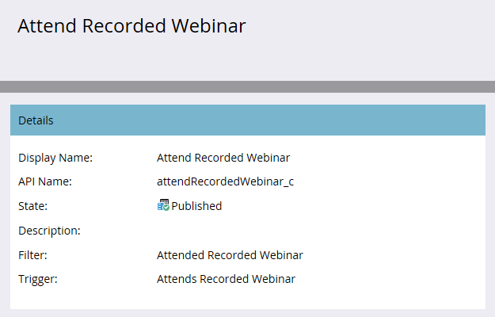

# Publicación de una actividad personalizada {#publish-a-custom-activity}

Obtenga información sobre cómo publicar su actividad personalizada.

1. Vaya al área de **[!UICONTROL Admin]**.

   

1. Haga clic en **[!UICONTROL Actividades personalizadas de Marketo]**.

   

1. Seleccione la actividad personalizada que desee publicar.

   

1. Haga clic en el menú desplegable **[!UICONTROL Acciones de actividad personalizadas]** y seleccione **[!UICONTROL Actividad de publicación]**.

   

   El [!UICONTROL estado] de la actividad personalizada cambia de [!UICONTROL Borrador]...

   

   ...a [!UICONTROL Publicado].

   
