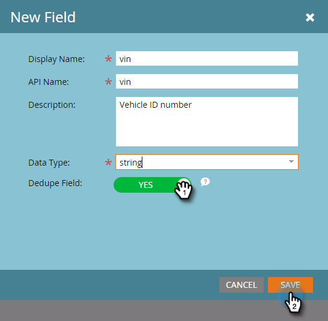

# Agregar campos de objeto personalizados de Marketo {#add-marketo-custom-object-fields}

Después de crear un objeto personalizado, debe agregarle campos para satisfacer sus necesidades comerciales.

Los campos definen la información específica que utiliza un objeto personalizado. Los campos de vínculos tienen un trabajo especial, conectar objetos personalizados y se tratan en una [artículo separado](/help/marketo/product-docs/administration/marketo-custom-objects/add-marketo-custom-object-link-fields.md).

1. Vaya a la **[!UICONTROL Administrador]** área.

   

1. Clic **[!UICONTROL Objetos personalizados de Marketo]**.

   

1. Seleccione el objeto al que desee añadir el campo a la derecha.

   

1. Haga clic en **[!UICONTROL Campos]** pestaña, luego **[!UICONTROL Nuevo campo]**.

   

   >[!NOTE]
   >
   >Marketo crea automáticamente los tres campos mostrados arriba cuando crea un objeto personalizado. Marketo administra estos campos automáticamente y no se pueden editar ni eliminar.

1. Introduzca una [!UICONTROL Nombre para mostrar] y (opcional) [!UICONTROL Descripción].

   

   >[!NOTE]
   >
   >El nombre de la API solo se puede editar hasta que se apruebe.

1. Ahora, elija un adecuado [!UICONTROL Tipo de datos] de la lista.

   

1. Tire de la [!UICONTROL Desduplicación] pase el cursor sobre si desea utilizar el nuevo campo como identificador único. Clic **[!UICONTROL Guardar]** para terminar.

   

   >[!TIP]
   >
   >Los campos desduplicados se pueden utilizar para recuperar, actualizar o eliminar objetos personalizados. Cada definición de objeto personalizada debe contener al menos un campo de desduplicación (y no más de tres).

1. Añada cualquier otro campo que necesite.

   >[!NOTE]
   >
   >Si está creando una estructura &quot;uno a varios&quot;, debe añadir un campo Vínculo al objeto personalizado. Para una estructura &quot;varios a varios&quot;, no se necesita un campo de vínculo en el objeto personalizado, pero se deben añadir dos campos de vínculo en el objeto intermedio. Consulte [Agregar campos de vínculo de objeto personalizado de Marketo](/help/marketo/product-docs/administration/marketo-custom-objects/add-marketo-custom-object-fields.md) para crear los campos de vínculo y [Explicación de los objetos personalizados de Marketo](/help/marketo/product-docs/administration/marketo-custom-objects/understanding-marketo-custom-objects.md) para obtener más información sobre los tipos de objetos personalizados.

>[!MORELIKETHIS]
>
>* [Agregar campos de vínculo de objeto personalizado de Marketo](/help/marketo/product-docs/administration/marketo-custom-objects/add-marketo-custom-object-link-fields.md)
>* [Editar y eliminar un objeto personalizado de Marketo](/help/marketo/product-docs/administration/marketo-custom-objects/edit-and-delete-a-marketo-custom-object.md)
>* [Editar y eliminar campos de objetos personalizados de Marketo](/help/marketo/product-docs/administration/marketo-custom-objects/edit-and-delete-marketo-custom-object-fields.md)
>* [Explicación de los objetos personalizados de Marketo](/help/marketo/product-docs/administration/marketo-custom-objects/understanding-marketo-custom-objects.md)
