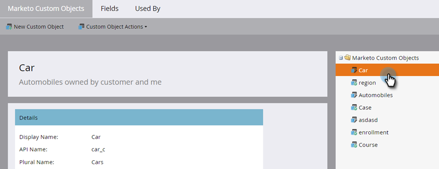
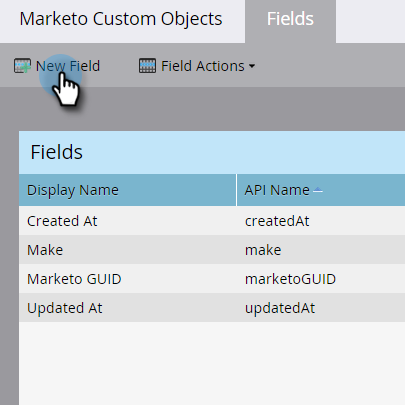
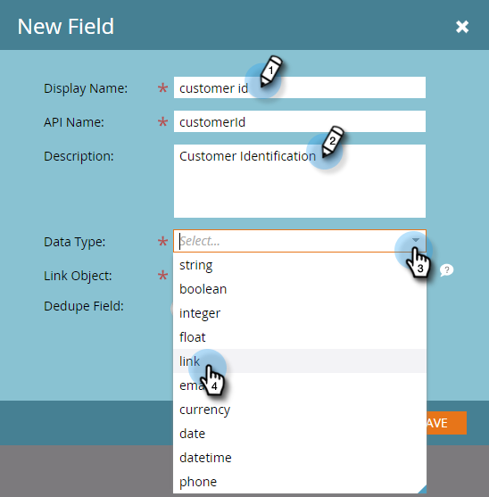
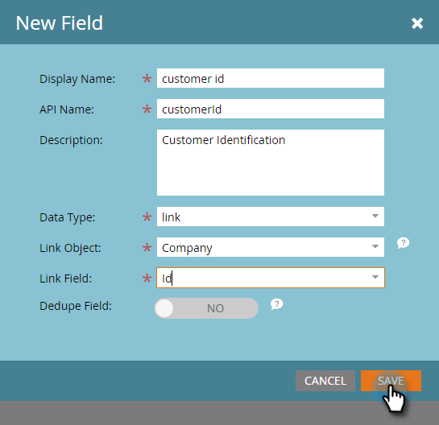
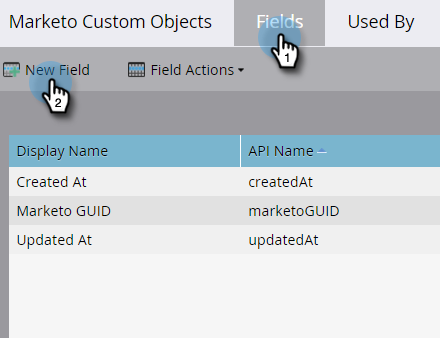
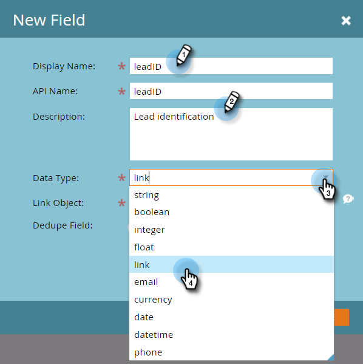
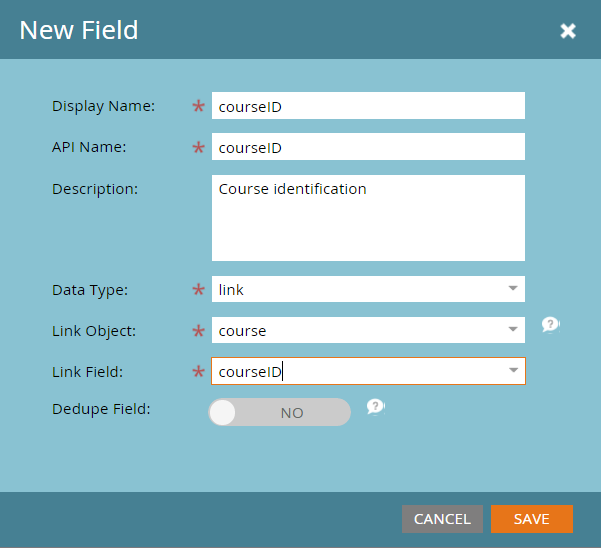
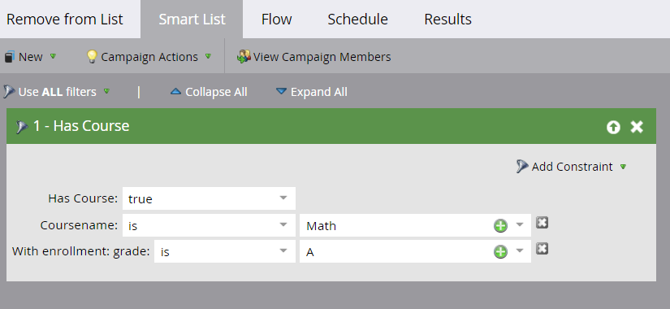

# Añadir campos de vínculo de objetos personalizables de Marketo {#add-marketo-custom-object-link-fields}

Al crear objetos personalizados, debe proporcionar campos de vínculo para conectar el registro de objeto personalizado al registro principal correcto.

* Para una estructura personalizada de uno a varios, utilice el campo de vínculo del objeto personalizado para conectarlo a una persona o compañía.
* Para una estructura de varios a varios, se utilizan dos campos de vínculo, conectados desde un objeto intermedio creado por separado (que también es un tipo de objeto personalizado). Un vínculo se conecta a personas o empresas de la base de datos y el otro al objeto personalizado. En este caso, el campo de vínculo no se encuentra en el propio objeto personalizado.

>[!IMPORTANT]
>
>Marketo Engage solo admite un objeto Edge único para cada objeto Bridge en la relación de varios a varios. En el ejemplo que se muestra a continuación, cada inscripción solo puede vincularse a un único curso. Sin embargo, puede haber muchos objetos puente para cada objeto edge, al igual que hay muchas inscripciones de alumnos en cada curso (relación Varios a uno). Si los datos de objeto personalizados están estructurados de modo que haya más de un registro de objeto de Edge para cada registro de objeto de Bridge (uno a varios o varios a varios), puede crear varios registros de objeto de Bridge, cada uno de los cuales hace referencia a un único registro de objeto de Edge para representar esos datos en Marketo.

## Creación de un campo de vínculo para una estructura &quot;uno a varios&quot; {#create-a-link-field-for-a-one-to-many-structure}

Siga los pasos a continuación para crear un campo de vínculo en un objeto personalizado para una estructura &quot;uno a varios&quot;.

1. Vaya al área de **[!UICONTROL Admin]**.

   

1. Haga clic en **[!UICONTROL Objetos personalizados de Marketo]**.

   

1. Seleccione el objeto personalizado en la lista.

   

1. En la ficha **[!UICONTROL Campos]**, haga clic en **[!UICONTROL Nuevo campo]**.

   

1. Asigne un nombre al campo de vínculo y agregue una [!UICONTROL descripción] opcional. Seleccione el tipo de datos [!UICONTROL Link].

   

   >[!CAUTION]
   >
   >Una vez aprobado el objeto personalizado, no es posible volver atrás y crear, editar o eliminar un [!UICONTROL vínculo] o [!UICONTROL campo desduplicado].

1. Seleccione si el [!UICONTROL objeto de vínculo] es para un [!UICONTROL posible cliente] (persona) o una [!UICONTROL empresa].

   

   >[!NOTE]
   >
   >Si elige [!UICONTROL posible cliente], verá el ID, la dirección de correo electrónico y cualquier campo personalizado en la lista.
   >
   >Si elige [!UICONTROL empresa], verá el identificador y cualquier campo personalizado en la lista.

1. Seleccione el [!UICONTROL campo de vínculo] al que desee conectarse como elemento principal del nuevo campo.

   

   >[!NOTE]
   >
   >Solo se admiten tipos de campos de cadena en [!UICONTROL Campo de vínculo].

1. Haga clic en **[!UICONTROL Guardar]**.

   

## Creación de un campo de vínculo para una estructura &quot;varios a varios&quot; {#create-a-link-field-for-a-many-to-many-structure}

Siga los pasos a continuación para crear un campo de vínculo en un objeto intermedio para utilizarlo en una estructura de varios a varios.

>[!PREREQUISITES]
>
>Ya debe haber creado el objeto intermedio y los objetos personalizados con los que desea vincularlo.

1. Vaya al área de **[!UICONTROL Admin]**.

   

1. Haga clic en **[!UICONTROL Objetos personalizados de Marketo]**.

   

1. Seleccione el objeto intermedio al que desee agregar el campo.

   

1. En la ficha **[!UICONTROL Campos]**, haga clic en **[!UICONTROL Nuevo campo]**.

   

1. Cree dos campos de vínculo, uno a la vez. En primer lugar, asigne un nombre al campo de los miembros de la lista de la base de datos (por ejemplo, leadID). Agregue una [!UICONTROL descripción] opcional. Seleccione el [!UICONTROL vínculo] [!UICONTROL Tipo de datos].

   

   >[!CAUTION]
   >
   >Una vez aprobado el objeto personalizado, no es posible volver atrás y crear, editar o eliminar un [!UICONTROL vínculo] o [!UICONTROL campo desduplicado].

1. Seleccione [!UICONTROL Link Object] de la base de datos; en este caso, [!UICONTROL Lead].

   

1. Seleccione el [!UICONTROL campo de vínculo] al que desee conectarse, en este caso, [!UICONTROL Id].

   

   >[!NOTE]
   >
   >Solo se admiten tipos de campos de cadena en [!UICONTROL Campo de vínculo].

1. Haga clic en **[!UICONTROL Guardar]**.

   

1. Repita este proceso para el segundo vínculo a su objeto personalizado, en este ejemplo, courseID. El nombre de [!UICONTROL objeto de vínculo] será courseID y el [!UICONTROL campo de vínculo] será courseID. Dado que ya ha creado y aprobado el objeto personalizado del curso, estas selecciones están disponibles en los menús desplegables.

   

1. Cree cualquier otro campo que desee utilizar en el objeto intermedio, como enrollmentID o grade.

## Uso de objetos personalizados {#using-custom-objects}

El siguiente paso es utilizar estos objetos personalizados en filtros en sus campañas inteligentes. Con una relación &quot;varios a varios&quot;, puede seleccionar varias personas o empresas y varios objetos personalizados. En el ejemplo siguiente, se muestra cualquier persona de la base de datos que coincida con estos criterios. El campo Nombre de curso procede del objeto personalizado del curso y la nota de inscripción procede del objeto intermedio.

>[!MORELIKETHIS]
>
>* [Agregar campos de objeto personalizados de Marketo](/help/marketo/product-docs/administration/marketo-custom-objects/add-marketo-custom-object-fields.md)
>* [Editar y eliminar un objeto personalizado de Marketo](/help/marketo/product-docs/administration/marketo-custom-objects/edit-and-delete-a-marketo-custom-object.md)
>* [Explicación de los objetos personalizados de Marketo](/help/marketo/product-docs/administration/marketo-custom-objects/understanding-marketo-custom-objects.md)
>* [Editar y eliminar campos de objetos personalizados de Marketo](/help/marketo/product-docs/administration/marketo-custom-objects/edit-and-delete-marketo-custom-object-fields.md)
