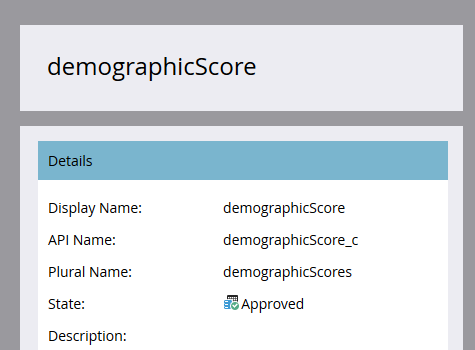

# Aprobar un objeto personalizado {#approve-a-custom-object}

Debe aprobar un objeto personalizado para poder utilizarlo. El proceso es ligeramente diferente para los nuevos objetos personalizados y los que ha editado.

## Aprobar un nuevo objeto personalizado {#approve-a-new-custom-object}

Ha creado un objeto personalizado completamente nuevo. Así es como aprobarlo.

1. Vaya a la **Administrador** .

   

1. Haga clic en **Objetos personalizados de Marketo**.

   

1. Seleccione un objeto que esté en estado borrador.

   

1. Haga clic en el **Acciones de objeto personalizado** y seleccione **Aprobar objeto**.

   

1. El estado cambia a Aprobado.

   

   >[!NOTE]
   >
   >Un objeto personalizado que se utiliza en un _estructura de uno a varios_ debe tener al menos un campo de deduplicación, un campo de vínculo, un nombre de objeto vinculado y un nombre de campo vinculado para ser aprobado.
   >
   >Un objeto personalizado que se utiliza en un _estructura &quot;varios a varios&quot;_ **no** necesita un campo de vínculo, un nombre de objeto vinculado o un nombre de campo vinculado al aprobarlo (ya que residen en el objeto intermedio).
   >
   >Un objeto personalizado que se utiliza como _objeto intermediario_ requiere un campo de vínculo, un nombre de objeto vinculado y un nombre de campo vinculado, pero **no** requieren un campo de deduplicación.
   >
   >Consulte [Explicación de los objetos personalizados de Marketo](/help/marketo/product-docs/administration/marketo-custom-objects/understanding-marketo-custom-objects.md) para obtener más información.

¡Eso es todo! Ahora, puede seleccionar el objeto personalizado en las restricciones de los filtros y déclencheur que desee utilizar en las campañas.

## Aprobar un objeto personalizado editado {#approve-an-edited-custom-object}

Después de editar un objeto personalizado aprobado, debe aprobar el borrador para devolver el objeto personalizado a un estado Aprobado.

1. Cuando edita un objeto personalizado ya aprobado, recibe un estado Approved with Draft .

   

1. Cuando esté listo para aprobar el borrador, haga clic en el **Acciones de objeto personalizado** y seleccione **Aprobar objeto**.

   

1. Una vista previa muestra los elementos que se han cambiado en el borrador. Haga clic en **Aprobar**.

   
