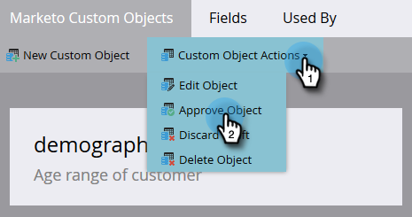

# Aprobar un objeto personalizado {#approve-a-custom-object}

Debe aprobar un objeto personalizado para poder utilizarlo. El proceso es ligeramente diferente para los nuevos objetos personalizados y los que ha editado.

## Aprobar un nuevo objeto personalizado {#approve-a-new-custom-object}

Ha creado un objeto personalizado completamente nuevo. Así es como se aprueba.

1. Vaya al área de **[!UICONTROL Admin]**.

   

1. Haga clic en **[!UICONTROL Objetos personalizados de Marketo]**.

   

1. Seleccione un objeto que esté en estado de Borrador.

   

1. Haga clic en el menú desplegable **[!UICONTROL Acciones de objeto personalizadas]** y seleccione **[!UICONTROL Aprobar objeto]**.

   

1. El estado cambia a [!UICONTROL Aprobado].

   

   >[!NOTE]
   >
   >Un objeto personalizado utilizado en una _estructura &quot;uno a varios&quot;_ debe tener al menos un campo desduplicado, un campo de vínculo, un nombre de objeto vinculado y un nombre de campo vinculado para ser aprobado.
   >
   >Un objeto personalizado que se usa en una estructura _varios a varios_ **no** necesita un campo de vínculo, un nombre de objeto vinculado o un nombre de campo vinculado cuando lo aprueba (porque residen en el objeto intermedio).
   >
   >Un objeto personalizado que se usa como _objeto intermedio_ requiere un campo de vínculo, un nombre de objeto vinculado y un nombre de campo vinculado, pero **no** requiere un campo desduplicado.
   >
   >Consulte [Explicación de los objetos personalizados de Marketo](/help/marketo/product-docs/administration/marketo-custom-objects/understanding-marketo-custom-objects.md) para obtener más información.

¡Eso es todo! Ahora puede seleccionar el objeto personalizado dentro de las restricciones de los filtros y déclencheur para utilizarlo en sus campañas.

## Aprobar un objeto personalizado editado {#approve-an-edited-custom-object}

Después de editar un objeto personalizado aprobado, debe aprobar el borrador para devolver el objeto personalizado a un estado Aprobado.

1. Cuando edita un objeto personalizado ya aprobado, recibe un estado [!UICONTROL Aprobado con Borrador].

   

1. Cuando esté listo para aprobar el borrador, haga clic en la lista desplegable **[!UICONTROL Acciones de objeto personalizadas]** y seleccione **[!UICONTROL Aprobar objeto]**.

   

1. Una vista previa muestra los elementos modificados en el borrador. Haga clic en **[!UICONTROL Aprobar]**.

   
