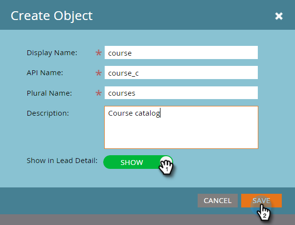

# Crear objetos personalizados de Marketo {#create-marketo-custom-objects}

Utilice objetos personalizados en Marketo para realizar un seguimiento de las métricas específicas de su empresa. Esto puede ser cualquier cosa, desde coches hasta cursos, lo que desee modelar en Marketo para ejecutar sus campañas.

>[!NOTE]
>
>Puede configurar objetos personalizados para que funcionen de uno a varios o de varios a varios. El objeto inicial se crea del mismo modo, pero los pasos son diferentes cuando se comienzan a agregar campos al objeto. Consulte [Explicación de los objetos personalizados de Marketo](/help/marketo/product-docs/administration/marketo-custom-objects/understanding-marketo-custom-objects.md) para obtener más información.

>[!NOTE]
>
>Una vez aprobado el objeto personalizado, no se pueden crear, editar ni eliminar vínculos ni desduplicar campos.

## Crear un objeto personalizado para una estructura de uno a varios {#create-a-custom-object-for-a-one-to-many-structure}

En este ejemplo se muestra un objeto personalizado Car para su uso en una estructura de uno a varios. Posteriormente, creará un objeto personalizado de curso y un objeto intermedio para utilizarlo en una estructura de varios a varios.

1. Haga clic en **Administración** y, en **Administración de bases de datos**, seleccione **Objetos personalizados de Marketo**.

   

1. Haga clic en **Nuevo objeto personalizado**.

   

   >[!NOTE]
   >
   >La ficha Objetos personalizados de Marketo muestra todos los objetos personalizados de la derecha y los detalles de los aprobados, incluido el número de registros y campos en la actualización más reciente.

1. Introduzca un nombre para mostrar. El nombre de la API y el nombre plural se rellenan automáticamente. Introduzca una descripción (opcional).

   

   >[!NOTE]
   >
   >Puede editar estos campos al crearlos, pero después de guardarlos, solo puede editar el campo Nombre de plural y el control deslizante **Mostrar en detalle de posible cliente**.

1. Tire del control deslizante **Mostrar en detalle de posible cliente** para mostrar **Mostrar** si desea ver los datos de objeto personalizados en la página Base de datos de posibles clientes. Haga clic en **Guardar**.

   

1. La información del objeto personalizado muestra el contenido que ha introducido. Observe que está en estado Borrador.

   

   El siguiente paso es agregar campos a [crear el objeto personalizado](/help/marketo/product-docs/administration/marketo-custom-objects/add-marketo-custom-object-fields.md).

   >[!NOTE]
   >
   >Solo puede rellenar Marketo Custom Objects mediante una importación de lista o la [API](https://developers.marketo.com/documentation/rest/).

## Crear un objeto personalizado para una estructura &quot;varios a varios&quot; {#create-a-custom-object-for-a-many-to-many-structure}

Este ejemplo muestra un objeto personalizado del curso que se utilizará para crear una relación de varios a varios entre personas/empresas y cursos. Cuando haya terminado, creará un objeto intermedio para conectarlo a personas o empresas de la base de datos.

>[!NOTE]
>
>Para una relación de varios a varios, no es necesario crear un vínculo en el objeto personalizado. En su lugar, agregará dos vínculos al objeto intermedio (consulte a continuación).

1. Haga clic en **Administración** y, en **Administración de bases de datos**, seleccione **Objetos personalizados de Marketo**.

   

1. Haga clic en **Nuevo objeto personalizado**.

   

1. Introduzca un nombre para mostrar. El nombre de la API y el nombre plural se rellenan automáticamente. Introduzca una descripción (opcional).

   

   >[!NOTE]
   >
   >Puede editar estos campos al crearlos, pero después de guardarlos, solo puede editar el campo Nombre de plural y el control deslizante **Mostrar en detalle de posible cliente**.

1. Tire del control deslizante **Mostrar en detalle de posible cliente** para mostrar **Mostrar** si desea ver los datos de objeto personalizados en la página Base de datos de posibles clientes. Haga clic en **Guardar**.

   

1. La información del objeto personalizado muestra el contenido que ha introducido. Observe que está en estado Borrador.

   

   >[!NOTE]
   >
   >Solo puede rellenar Marketo Custom Objects mediante una importación de lista o la [API](https://developers.marketo.com/documentation/rest/).

El siguiente paso es crear el objeto intermediario (consulte a continuación). Pero antes de eso, debe crear un campo para vincularlo a él.

## Crear un objeto intermedio {#create-an-intermediary-object}

Utilice un objeto intermedio para conectar un objeto personalizado a personas o empresas. En este ejemplo, se utiliza para conectar cursos en el objeto personalizado del curso a personas o empresas de la base de datos.

>[!NOTE]
>
>No es necesario crear un objeto intermedio para una estructura de objetos personalizada de uno a varios.

1. Haga clic en **Administración** y, en **Administración de bases de datos**, seleccione **Objetos personalizados de Marketo**.

   

1. Haga clic en **Nuevo objeto personalizado**.

   

1. Introduzca un nombre para mostrar. El nombre de la API y el nombre plural se rellenan automáticamente. Introduzca una descripción (opcional).

   

   >[!NOTE]
   >
   >Puede editar estos campos cuando los esté creando, pero después de guardarlos, solo puede editar el campo Nombre de plural y el control deslizante Mostrar en detalle de posible cliente .

1. Tire del control deslizante **Mostrar en detalle de posible cliente** para mostrar **Mostrar** si desea ver los datos de objeto personalizados en la página Base de datos de posibles clientes. Haga clic en **Guardar**.

   

1. La información del objeto personalizado muestra el contenido que ha introducido. Observe que está en estado Borrador.

   El siguiente paso es [añadir campos de vínculo](/help/marketo/product-docs/administration/marketo-custom-objects/add-marketo-custom-object-link-fields.md) para conectar el objeto intermedio a una persona o empresa y un objeto personalizado.

>[!MORELIKETHIS]
>
>* [Agregar campos de objeto personalizados de Marketo](/help/marketo/product-docs/administration/marketo-custom-objects/add-marketo-custom-object-fields.md)
>* [Agregar campos de vínculo de objeto personalizado de Marketo](/help/marketo/product-docs/administration/marketo-custom-objects/add-marketo-custom-object-link-fields.md)
>* [Explicación de los objetos personalizados de Marketo](/help/marketo/product-docs/administration/marketo-custom-objects/understanding-marketo-custom-objects.md)

