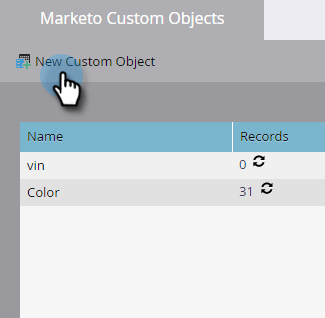

# Crear objetos personalizados de Marketo {#create-marketo-custom-objects}

Utilice objetos personalizados en Marketo para realizar un seguimiento de métricas específicas de su empresa. Esto puede ser cualquier cosa, desde autos hasta cursos, todo lo que desee modelar en Marketo para ejecutar sus campañas.

>[!NOTE]
>
>Puede configurar objetos personalizados para que funcionen de uno a varios o de varios a varios. El objeto inicial se crea del mismo modo, pero los pasos son diferentes cuando se empieza a agregar campos al objeto. Consulte  [Explicación de los objetos personalizados de Marketo](/help/marketo/product-docs/administration/marketo-custom-objects/understanding-marketo-custom-objects.md) para obtener más información.

>[!NOTE]
>
>Una vez aprobado el objeto personalizado, no se puede crear, editar ni eliminar un vínculo o un campo desduplicado.

## Crear un objeto personalizado para una estructura &quot;uno a varios&quot; {#create-a-custom-object-for-a-one-to-many-structure}

Este ejemplo muestra un objeto personalizado Car para utilizarlo en una estructura &quot;uno a varios&quot;. Más adelante, creará un objeto personalizado del curso y un objeto intermedio para utilizarlo en una estructura de varios a varios.

1. Vaya a la **[!UICONTROL Administrador]** área.

   

1. Clic **[!UICONTROL Objetos personalizados de Marketo]**.

   

1. Clic **[!UICONTROL Nuevo objeto personalizado]**.

   

   >[!NOTE]
   >
   >El [!UICONTROL Objetos personalizados de Marketo] Esta pestaña muestra todos los objetos personalizados de la derecha y los detalles de los aprobados, incluido el número de registros y campos de la actualización más reciente.

1. Introduzca una [!UICONTROL Nombre para mostrar]. El [!UICONTROL Nombre de API] y [!UICONTROL Nombre plural] rellenar automáticamente. Introduzca una [!UICONTROL Descripción] (opcional).

   

   >[!NOTE]
   >
   >Puede editar estos campos cuando los esté creando, pero después de guardarlos, solo puede editar los campos [!UICONTROL Nombre plural] y el **[!UICONTROL Mostrar en detalle de posibles clientes]** deslizador.

1. Tire de la **[!UICONTROL Mostrar en detalle de posibles clientes]** deslizador hacia la pantalla **[!UICONTROL Mostrar]** si desea ver datos de objeto personalizados en la página Base de datos. Haga clic en **[!UICONTROL Guardar]**.

   

1. La información de objeto personalizada muestra el contenido que ha introducido. Observe que está en estado de Borrador.

   

   El siguiente paso es agregar campos a [crear el objeto personalizado](/help/marketo/product-docs/administration/marketo-custom-objects/add-marketo-custom-object-fields.md).

   >[!NOTE]
   >
   >Solo puede rellenar Objetos personalizados de Marketo mediante una importación de lista o el [API](https://experienceleague.adobe.com/en/docs/marketo-developer/marketo/rest/rest-api).

## Creación de un objeto personalizado para una estructura &quot;varios a varios&quot; {#create-a-custom-object-for-a-many-to-many-structure}

En este ejemplo se muestra un objeto personalizado de curso, que se utiliza para crear una relación &quot;varios a varios&quot; entre personas/empresas y cursos. Cuando haya terminado, creará un objeto intermedio para conectarlo a personas o empresas de la base de datos.

>[!NOTE]
>
>Para una relación &quot;varios a varios&quot;, no es necesario crear un vínculo en el objeto personalizado. En su lugar, agregará dos vínculos al objeto intermedio (consulte a continuación).

1. Vaya a la **[!UICONTROL Administrador]** área.

   

1. Clic **[!UICONTROL Objetos personalizados de Marketo]**.

   

1. Clic **[!UICONTROL Nuevo objeto personalizado]**.

   

1. Introduzca una [!UICONTROL Nombre para mostrar]. El [!UICONTROL Nombre de API] y [!UICONTROL Nombre plural] rellenar automáticamente. Introduzca una [!UICONTROL Descripción] (opcional).

   

   >[!NOTE]
   >
   >Puede editar estos campos cuando los esté creando, pero después de guardarlos, solo puede editar los campos [!UICONTROL Nombre plural] y el **[!UICONTROL Mostrar en detalle de posibles clientes]** deslizador.

1. Tire de la **[!UICONTROL Mostrar en detalle de posibles clientes]** deslizador hacia la pantalla **[!UICONTROL Mostrar]** si desea ver datos de objeto personalizados en la página Base de datos. Haga clic en **[!UICONTROL Guardar]**.

   

1. La información de objeto personalizada muestra el contenido que ha introducido. Observe que está en estado de Borrador.

   

   >[!NOTE]
   >
   >Solo puede rellenar Objetos personalizados de Marketo mediante una importación de lista o el [API](https://experienceleague.adobe.com/en/docs/marketo-developer/marketo/rest/rest-api).

El siguiente paso es crear el objeto intermedio (consulte a continuación). Pero antes de eso, debe crear un campo al que vincularse.

## Crear un objeto intermedio {#create-an-intermediary-object}

Utilice un objeto intermedio para conectar un objeto personalizado a personas o empresas. En este ejemplo, se utiliza para conectar cursos del objeto personalizado del curso a personas o empresas de la base de datos.

>[!NOTE]
>
>No es necesario crear un objeto intermedio para una estructura de objetos personalizada de uno a varios.

1. Vaya a la **[!UICONTROL Administrador]** área.

   

1. Clic **[!UICONTROL Objetos personalizados de Marketo]**.

   

1. Clic **[!UICONTROL Nuevo objeto personalizado]**.

   

1. Introduzca una [!UICONTROL Nombre para mostrar]. El [!UICONTROL Nombre de API] y [!UICONTROL Nombre plural] rellenar automáticamente. Introduzca una [!UICONTROL Descripción] (opcional).

   

   >[!NOTE]
   >
   >Puede editar estos campos cuando los esté creando, pero después de guardarlos, solo puede editar los campos [!UICONTROL Nombre plural] y el [!UICONTROL Mostrar en detalle de posibles clientes] deslizador.

1. Tire de la **[!UICONTROL Mostrar en detalle de posibles clientes]** deslizador hacia la pantalla **Mostrar** si desea ver datos de objeto personalizados en la página Base de datos. Haga clic en **Guardar**.

   

1. La información de objeto personalizada muestra el contenido que ha introducido. Observe que está en estado de Borrador.

   El siguiente paso es que [añadir campos de vínculo](/help/marketo/product-docs/administration/marketo-custom-objects/add-marketo-custom-object-link-fields.md) para conectar el objeto intermedio a una persona o compañía y a un objeto personalizado.

>[!MORELIKETHIS]
>
>* [Agregar campos de objeto personalizados de Marketo](/help/marketo/product-docs/administration/marketo-custom-objects/add-marketo-custom-object-fields.md)
>* [Agregar campos de vínculo de objeto personalizado de Marketo](/help/marketo/product-docs/administration/marketo-custom-objects/add-marketo-custom-object-link-fields.md)
>* [Explicación de los objetos personalizados de Marketo](/help/marketo/product-docs/administration/marketo-custom-objects/understanding-marketo-custom-objects.md)
