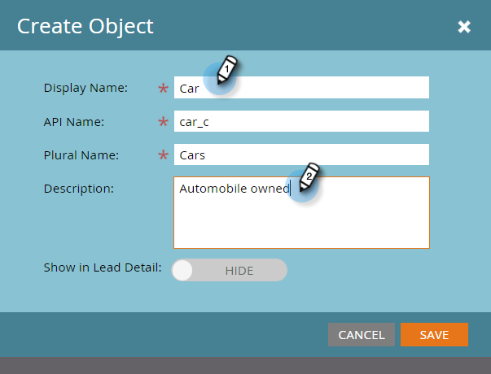
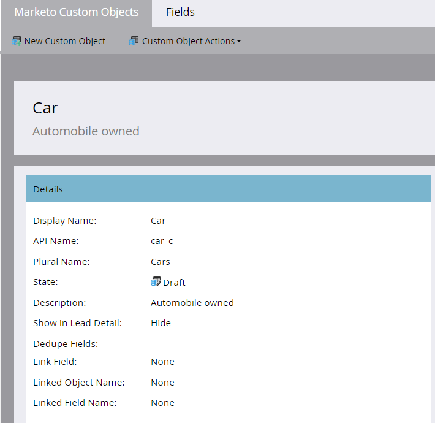
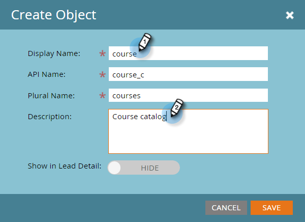
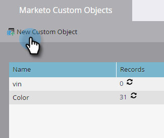

# Crear objetos personalizables de Marketo {#create-marketo-custom-objects}

Utilice objetos personalizados en Marketo para realizar un seguimiento de métricas específicas de su empresa. Esto puede ser cualquier cosa, desde autos hasta cursos, lo que sea que desee modelar en Marketo para ejecutar sus campañas.

>[!NOTE]
>
>Puede configurar objetos personalizados para que funcionen de uno a varios o de varios a varios. El objeto inicial se crea del mismo modo, pero los pasos son diferentes cuando se empieza a agregar campos al objeto. Consulte [Explicación de los objetos personalizados de Marketo](/help/marketo/product-docs/administration/marketo-custom-objects/understanding-marketo-custom-objects.md) para obtener más información.

>[!NOTE]
>
>Una vez aprobado el objeto personalizado, no se puede crear, editar ni eliminar un vínculo o un campo desduplicado.

## Crear un objeto personalizado para una estructura &quot;uno a varios&quot; {#create-a-custom-object-for-a-one-to-many-structure}

Este ejemplo muestra un objeto personalizado Car para utilizarlo en una estructura &quot;uno a varios&quot;. Más adelante, creará un objeto personalizado del curso y un objeto intermedio para utilizarlo en una estructura de varios a varios.

1. Vaya al área de **[!UICONTROL Admin]**.

   

1. Haga clic en **[!UICONTROL Objetos personalizados de Marketo]**.

   

1. Haga clic en **[!UICONTROL Nuevo objeto personalizado]**.

   

   >[!NOTE]
   >
   >La pestaña [!UICONTROL Objetos personalizados de Marketo] muestra todos los objetos personalizados a la derecha y los detalles de los objetos aprobados, incluido el número de registros y campos de la actualización más reciente.

1. Escriba un [!UICONTROL Nombre para mostrar]. [!UICONTROL Nombre de API] y [!UICONTROL Nombre plural] se rellenan automáticamente. Escriba una [!UICONTROL descripción] (opcional).

   

   >[!NOTE]
   >
   >Puede editar estos campos cuando los esté creando, pero una vez guardados, solo podrá editar el campo [!UICONTROL Nombre plural] y el control deslizante **[!UICONTROL Mostrar en detalle del posible cliente]**.

1. Pase el control deslizante **[!UICONTROL Mostrar en detalle de posibles clientes]** para mostrar **[!UICONTROL Mostrar]** si desea ver datos de objetos personalizados en la página Base de datos. Haga clic en **[!UICONTROL Guardar]**.

   

1. La información de objeto personalizada muestra el contenido que ha introducido. Observe que está en estado **[!UICONTROL Borrador]**.

   

   El siguiente paso es agregar campos a [crear su objeto personalizado](/help/marketo/product-docs/administration/marketo-custom-objects/add-marketo-custom-object-fields.md).

   >[!NOTE]
   >
   >Solo puede rellenar objetos personalizados de Marketo mediante una importación de lista o la [API](https://experienceleague.adobe.com/es/docs/marketo-developer/marketo/rest/rest-api).

## Creación de un objeto personalizado para una estructura &quot;varios a varios&quot; {#create-a-custom-object-for-a-many-to-many-structure}

En este ejemplo se muestra un objeto personalizado de curso, que se utiliza para crear una relación &quot;varios a varios&quot; entre personas o empresas y cursos. Cuando haya terminado, creará un objeto intermedio para conectarlo a personas o empresas de la base de datos.

>[!NOTE]
>
>Para una relación &quot;varios a varios&quot;, no es necesario crear un vínculo en el objeto personalizado. En su lugar, agregará dos vínculos al objeto intermedio (consulte a continuación).

1. Vaya al área de **[!UICONTROL Admin]**.

   

1. Haga clic en **[!UICONTROL Objetos personalizados de Marketo]**.

   

1. Haga clic en **[!UICONTROL Nuevo objeto personalizado]**.

   

1. Escriba un [!UICONTROL Nombre para mostrar]. [!UICONTROL Nombre de API] y [!UICONTROL Nombre plural] se rellenan automáticamente. Escriba una [!UICONTROL descripción] (opcional).

   

   >[!NOTE]
   >
   >Puede editar estos campos cuando los esté creando, pero una vez guardados, solo podrá editar el campo [!UICONTROL Nombre plural] y el control deslizante **[!UICONTROL Mostrar en detalle del posible cliente]**.

1. Pase el control deslizante **[!UICONTROL Mostrar en detalle de posibles clientes]** para mostrar **[!UICONTROL Mostrar]** si desea ver datos de objetos personalizados en la página Base de datos. Haga clic en **[!UICONTROL Guardar]**.

   

1. La información de objeto personalizada muestra el contenido que ha introducido. Observe que está en estado **[!UICONTROL Borrador]**.

   

   >[!NOTE]
   >
   >Solo puede rellenar objetos personalizados de Marketo mediante una importación de lista o la [API](https://experienceleague.adobe.com/es/docs/marketo-developer/marketo/rest/rest-api).

El siguiente paso es crear el objeto intermedio (consulte a continuación). Antes de ello, debe crear un campo al que vincularse.

## Crear un objeto intermedio {#create-an-intermediary-object}

Utilice un objeto intermedio para conectar un objeto personalizado a personas o empresas. En este ejemplo, se utiliza para conectar cursos del objeto personalizado del curso a personas o empresas de la base de datos.

>[!NOTE]
>
>No es necesario crear un objeto intermedio para una estructura de objetos personalizada de uno a varios.

1. Vaya al área de **[!UICONTROL Admin]**.

   

1. Haga clic en **[!UICONTROL Objetos personalizados de Marketo]**.

   

1. Haga clic en **[!UICONTROL Nuevo objeto personalizado]**.

   

1. Escriba un [!UICONTROL Nombre para mostrar]. [!UICONTROL Nombre de API] y [!UICONTROL Nombre plural] se rellenan automáticamente. Escriba una [!UICONTROL descripción] (opcional).

   

   >[!NOTE]
   >
   >Puede editar estos campos cuando los esté creando, pero una vez guardados, solo podrá editar el campo [!UICONTROL Nombre plural] y el control deslizante [!UICONTROL Mostrar en detalle del posible cliente].

1. Pase el control deslizante **[!UICONTROL Mostrar en detalle de posibles clientes]** para mostrar **[!UICONTROL Mostrar]** si desea ver datos de objetos personalizados en la página Base de datos. Haga clic en **[!UICONTROL Guardar]**.

   

1. La información de objeto personalizada muestra el contenido que ha introducido. Observe que está en estado **[!UICONTROL Borrador]**.

   El siguiente paso es [agregar campos de vínculo](/help/marketo/product-docs/administration/marketo-custom-objects/add-marketo-custom-object-link-fields.md) para conectar el objeto intermedio a una persona o compañía y a un objeto personalizado.

>[!MORELIKETHIS]
>
>* [Agregar campos de objeto personalizados de Marketo](/help/marketo/product-docs/administration/marketo-custom-objects/add-marketo-custom-object-fields.md)
>* [Agregar campos de vínculo de objeto personalizado de Marketo](/help/marketo/product-docs/administration/marketo-custom-objects/add-marketo-custom-object-link-fields.md)
>* [Explicación de los objetos personalizados de Marketo](/help/marketo/product-docs/administration/marketo-custom-objects/understanding-marketo-custom-objects.md)
