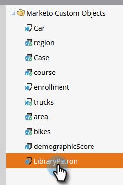

# Exportación de metadatos de objetos personalizados {#custom-object-metadata-export}

Si utiliza nuestra API SOAP o la API de Munchkin, se puede exportar el esquema de metadatos de objeto personalizado. Así es como conseguirlo.

1. En Mi Marketo, haga clic en **Admin**.

   

1. Haga clic en **Marketo Custom Objects**.

   

1. Seleccione el objeto personalizado de Marketo que desea exportar.

   

1. Haga clic en la lista desplegable **Acciones de objeto personalizado** y seleccione **Exportar objeto**.

   

>[!NOTE]
>
>El objeto personalizado debe estar en estado aprobado para poder exportarse.

Ahora tiene una hoja de cálculo con el esquema del objeto personalizado en tres fichas.

