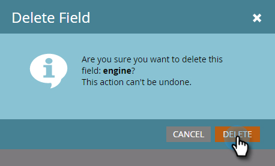

# Editar y eliminar campos de objeto personalizados de Marketo {#edit-and-delete-marketo-custom-object-fields}

## Editar un campo {#edit-a-field}

A veces es necesario editar un campo que aún no está aprobado.

1. Haga clic en un objeto personalizado y en el campo que desee editar.

   

1. En la ficha Campos, haga clic en **Acciones de campo** y **Editar campo**.

   

1. Realice los cambios y haga clic en **Guardar**.

   

   >[!NOTE]
   >
   >No puede editar el nombre de la API.

1. Los cambios aparecen en la lista Campos.

   

## Eliminar un campo {#delete-a-field}

Cuando ya no necesite un campo en un objeto personalizado, puede eliminarlo.

1. En la ficha Campos, haga clic en **Acciones de campo** y **Eliminar campo**.

   

   Asegúrese de que desea eliminar el campo antes de extraer el déclencheur. Haga clic en **Eliminar**.

   

   ¡Se ha ido!

   

   >[!NOTE]
   >
   >[Agregar campos de objeto personalizados de Marketo](/help/marketo/product-docs/administration/marketo-custom-objects/add-marketo-custom-object-fields.md)
