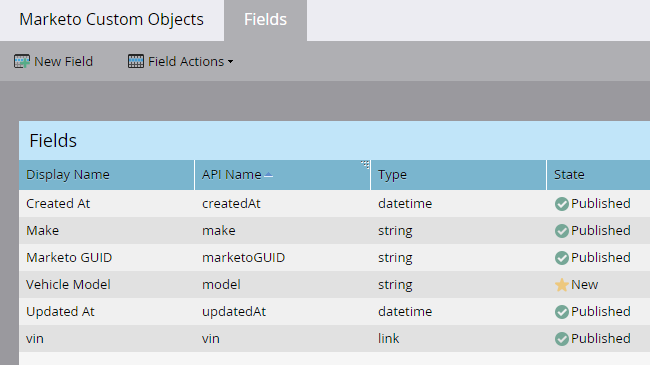

# Editar y eliminar campos de objetos personalizados de Marketo {#edit-and-delete-marketo-custom-object-fields}

## Editar un campo {#edit-a-field}

A veces, es necesario editar un campo que aún no está aprobado.

1. Haga clic en un objeto personalizado y seleccione el campo que desee editar.

   

1. En la ficha [!UICONTROL Campos], haga clic en **[!UICONTROL Acciones de campo]** y **[!UICONTROL Editar campo]**.

   

1. Realice los cambios y haga clic en **[!UICONTROL Guardar]**.

   

   >[!NOTE]
   >
   >No puede editar el nombre de la API.

1. Los cambios aparecerán en el listado de **[!UICONTROL Campos]**.

   

## Eliminar un campo {#delete-a-field}

Cuando ya no necesite un campo en un objeto personalizado, puede eliminarlo.

1. En la pestaña Campos, haga clic en **[!UICONTROL Acciones de campo]** y **[!UICONTROL Eliminar campo]**.

   

1. Asegúrese de que realmente desea eliminar el campo antes de extraer el déclencheur. Haga clic en **[!UICONTROL Eliminar]**.

   

¡Se ha ido!

>[!NOTE]
>
>[Agregar campos de objeto personalizados de Marketo](/help/marketo/product-docs/administration/marketo-custom-objects/add-marketo-custom-object-fields.md)
