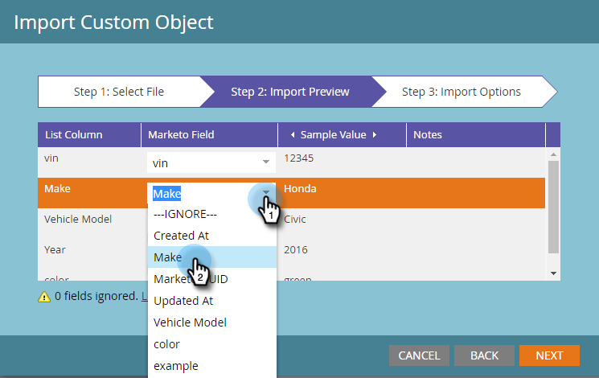

# Importar datos de objeto personalizados {#import-custom-object-data}

Es fácil importar datos de objetos personalizados en la base de datos. Si utiliza objetos personalizados con empresas, consulte [Uso de objetos personalizados con compañías](/help/marketo/product-docs/administration/marketo-custom-objects/understanding-marketo-custom-objects.md#using-custom-objects-with-companies) para obtener más información.

1. En Mi Marketo, vaya a **Database**.

   

1. Haga clic en **Nuevo** y seleccione **Importar datos de objeto personalizados**.

   

1. Haga clic en **Examinar** para localizar el archivo de datos. Seleccione el formato de archivo (Valores separados por comas en este ejemplo).

   

1. Seleccione el objeto personalizado.

   

1. Seleccione el Modo de desduplicación en la lista desplegable. Haga clic en **Siguiente**.

   

   >[!NOTE]
   >
   >Utilice los campos de desduplicación como identificadores únicos al crear o actualizar registros de objeto personalizados. Este ejemplo utiliza el campo Dedupe del **car** objeto personalizado: vin (número de ID del vehículo). Si solo está actualizando registros de objeto personalizados, puede seleccionar la guía de Marketo como modo de desduplicación.

1. Asigne cada columna a un campo de Marketo, seleccionándolo en la lista desplegable.

   

   >[!NOTE]
   >
   >Asegúrese de que los valores del archivo coinciden con el tipo de campo al que los está haciendo coincidir (por ejemplo, texto, entero, etc.); de lo contrario, el archivo se rechazará.

1. Haga clic en **Siguiente**.

   

1. Haga clic en **Import**.

   

   >[!NOTE]
   >
   >El límite de tamaño para los objetos personalizados es de 100 MB.

   >[!TIP]
   >
   >Introduzca su dirección de correo electrónico en el campo **Send Alert To:** y Marketo le enviará un correo electrónico cuando termine la importación.

1. En la esquina superior derecha de la pantalla, verá una notificación mientras se ejecuta la importación y los resultados finales cuando finalice.

   

   ¡Sí!

>[!MORELIKETHIS]
>
>[Explicación de los objetos personalizados de Marketo](/help/marketo/product-docs/administration/marketo-custom-objects/understanding-marketo-custom-objects.md)
